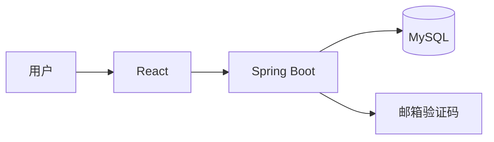
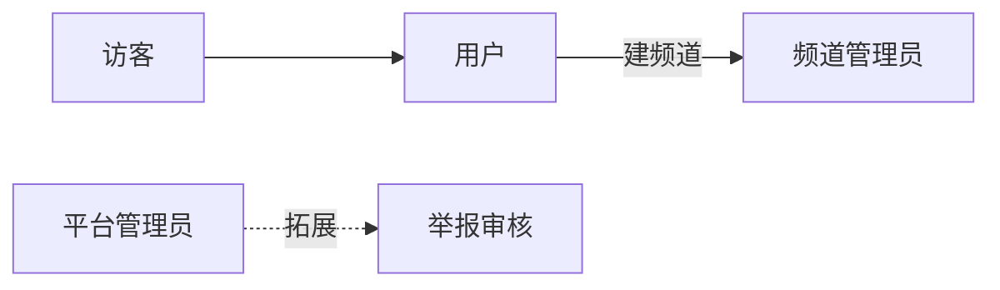
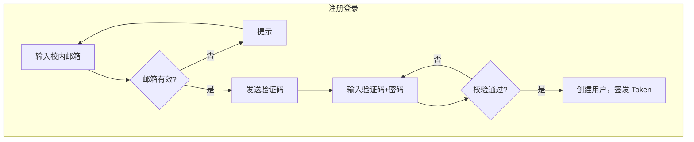
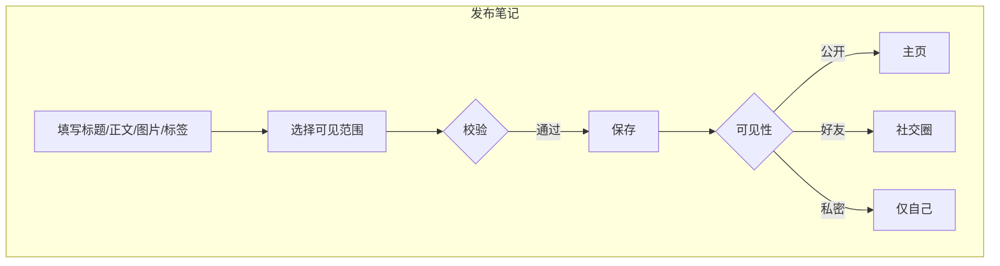
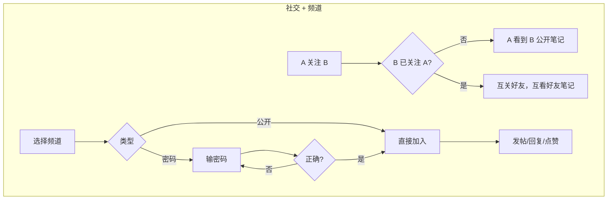
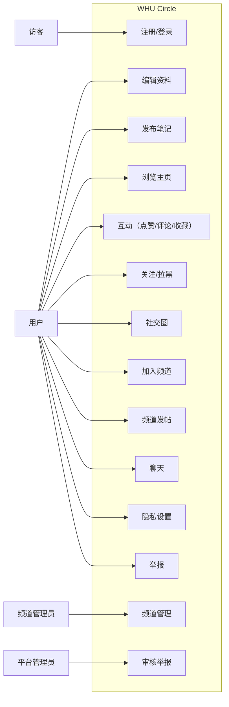
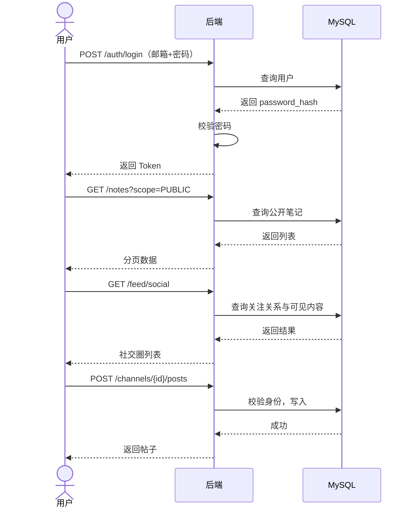
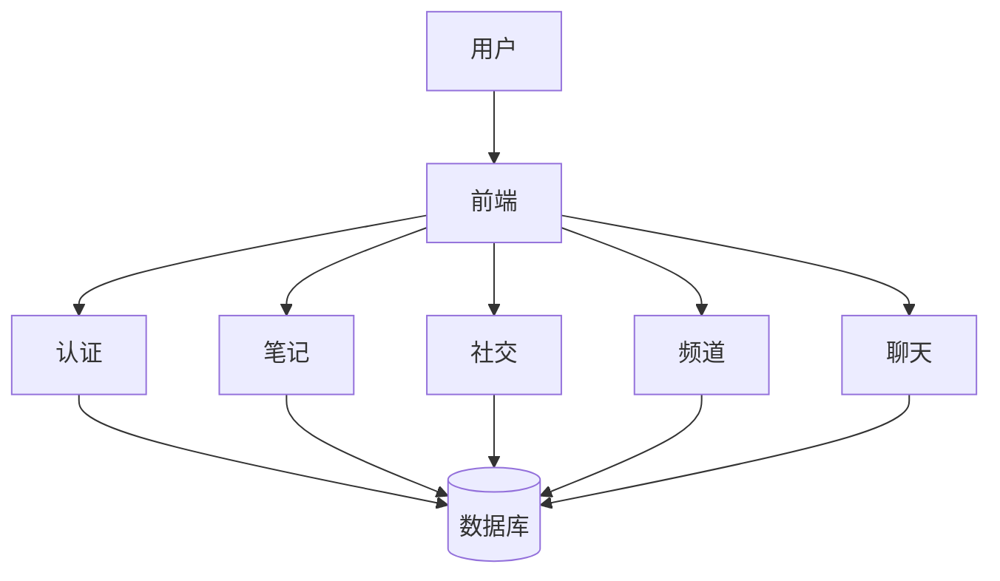
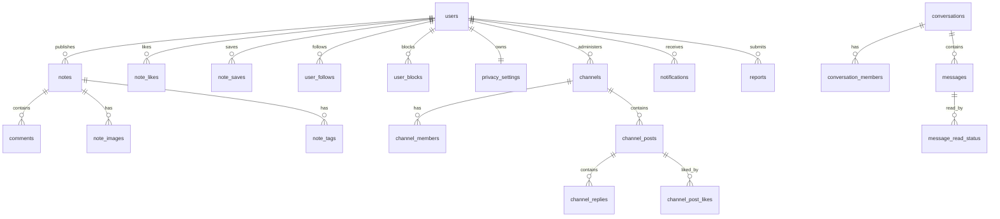
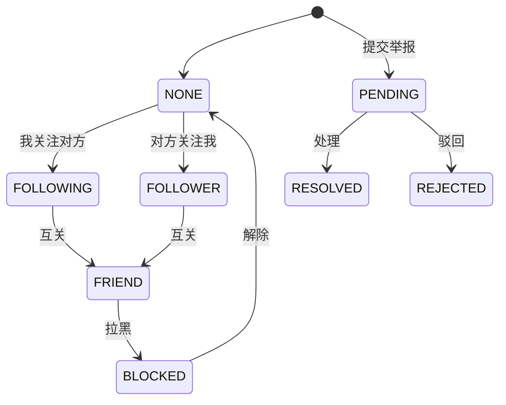

# WHU Circle 需求建模文档

## 一、用户需求说明

### 1.1 项目定位

WHU Circle 是以校园社交为核心的网页端系统，围绕内容分享、关系维护、频道讨论、日常聊天四个功能展开。

**基础功能**：校内邮箱注册与登录 / 图文笔记发布与浏览 / 关注与社交圈 / 公开与密码频道 / 私聊与群聊 / 隐私设置与举报。

### 1.2 用户角色

| 角色 | 说明 |
|---|---|
| **未登录访客** | 注册、登录、找回密码 |
| **普通用户** | 笔记、互动、关注、频道、聊天、隐私 |
| **频道管理员** | 创建频道后自动获得，可改公告和置顶 |
| **平台管理员** | 拓展角色，负责举报审核 |

### 1.3 核心业务需求

**认证与资料**：`@whu.edu.cn` 邮箱注册，验证码 5 分钟有效、60s 冷却、最多 5 次错误。登录签发 Token。用户维护昵称、头像、学院、年级、简介。

**笔记**：主页展示公开笔记，支持搜索和标签筛选。可见性分 PUBLIC / FRIENDS / PRIVATE。可点赞、评论、收藏。好友可见仅互关好友可看。

**社交**：关注为单向，互关后成好友。社交圈展示关注用户的笔记。拉黑后限制私信、评论和主页查看。

**频道**：公开直接加入，密码频道校验密码。未加入预览 5 条，加入后可发帖、回复、点赞。仅管理员可置顶和改公告。

**聊天**：好友私聊和群聊，会话按时间排序。后续可拓展已读和实时推送。

**通知与安全**：点赞、评论、收藏、回复触发通知。可设笔记默认可见范围和私信权限。可举报笔记、帖子、消息、用户。

### 1.4 业务流程图

## 二、需求分析建模

### 2.1 用例图

### 2.2 用例规约摘要

| 用例 | 流程要点 |
|---|---|
| **注册** | 输入邮箱 → 请求验证码 → 提交验证码+密码+昵称 → 校验通过后创建用户并返回 Token |
| **发布笔记** | 填写内容 → 选可见范围 → 系统校验后保存 → 按权限展示 |
| **加入频道** | 公开直接加入，密码频道校验后加入。未加入仅预览 5 条 |
| **频道发帖** | 仅成员可发帖，非成员不可操作 |

### 2.3 时序图

### 2.4 数据流图

### 2.5 ER 图

### 2.6 数据字典

| 实体 | 关键字段 |
|---|---|
| **用户** | id, email, password_hash, nickname, avatar_url, college, grade, bio |
| **笔记** | author_id, title, content, visibility, like_count, comment_count |
| **附属** | note_images, note_tags, comments, note_likes, note_saves |
| **社交** | user_follows, user_blocks, privacy_settings |
| **频道** | name, join_type(公开/密码), password_hash, administrator_id |
| **频道帖子** | channel_id, author_id, title, content, pinned |
| **聊天** | conversations(PRIVATE/GROUP), messages, message_read_status |
| **系统** | notifications, reports, email_verification_codes |

| 枚举 | 取值 |
|---|---|
| 笔记可见范围 | `PUBLIC` / `FRIENDS` / `PRIVATE` |
| 频道加入方式 | `PUBLIC` / `PASSWORD` |
| 会话类型 | `PRIVATE` / `GROUP` |
| 私信权限 | `EVERYONE` / `FRIENDS_ONLY` / `NONE` |
| 举报状态 | `PENDING` / `RESOLVED` / `REJECTED` |

### 2.7 状态图

## 三、非功能性需求说明

### 3.1 开发与运行环境

| 层级 | 技术栈 |
|---|---|
| 前端 | React 19 + Vite 6 |
| 后端 | Spring Boot 3.5.16 + JDK 17 + Maven 3.9 |
| 数据库 | MySQL 8.4（utf8mb4） |
| 接口文档 | springdoc-openapi / Swagger |

| 服务 | 地址 |
|---|---|
| 前端开发 | `http://127.0.0.1:5173` |
| 后端 API | `http://127.0.0.1:8080/api/v1` |
| Swagger | `http://127.0.0.1:8080/swagger-ui/index.html` |

### 3.2 系统依赖

- MySQL 8.4（Docker Compose）
- QQ 邮箱 SMTP（验证码发送）
- Spring Security Crypto（BCrypt）
- 不依赖 Redis / Nginx / 消息队列

### 3.3 安全性

- 密码 BCrypt 哈希存储
- 除认证接口外全量 Token 鉴权
- 后端统一校验可见性和频道成员权限
- 拉黑限制私信、评论和主页查看
- 数据库密码和邮箱授权码不提交 GitHub

### 3.4 性能与可维护性

- 列表分页返回，默认 20 条/页，首屏 < 2s
- 前端 API 集中维护在 `src/api/`
- 后端 Controller → Service → Repository 分层
- 响应统一 `{ code, message, data }`，枚举用英文常量

## 四、拓展实现目标

- **活动组织**：活动发布、报名、日历视图
- **管理后台**：举报审核、违规处理、数据统计
- **推荐优化**：基于标签和互动的内容排序
- **WebSocket**：实时消息推送
- **文件存储**：图片外链替换为对象存储
- **统一搜索**：用户、笔记、频道、帖子
- **移动端适配**：手机浏览器布局优化
