# WHU Circle 需求建模文档

## 一、用户需求说明

### 1.1 项目概述与范围

WHU Circle 是面向武汉大学学生的轻量级社交媒体原型系统，前后端分离架构。以动态分享、兴趣频道、私信沟通、个人主页和隐私控制为核心。

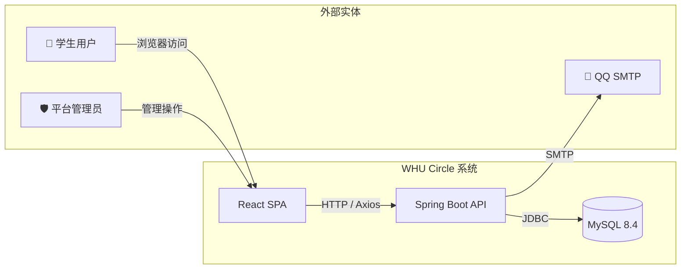

**业务目标**

| 优先级 | 业务能力 | 说明 |
|:---:|---|---|
| P0 | 用户认证 | 校内邮箱注册、登录、Token 鉴权 |
| P0 | 笔记系统 | 发布笔记、首页广场、评论、点赞、收藏 |
| P0 | 社交关系 | 关注/取关、互关好友、黑名单、社交圈动态 |
| P0 | 频道系统 | 创建/加入频道、发帖、回复、置顶 |
| P0 | 即时通讯 | 私聊与群聊、已读状态 |
| P1 | 通知与隐私 | 互动通知、隐私设置、内容举报 |

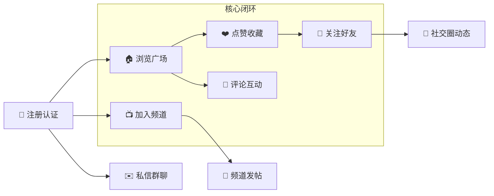

**范围说明**

| 范围内 | 范围外 |
|---|---|
| 校内邮箱注册与验证码认证 | 手机号/第三方登录 |
| 笔记发布（图文+标签）、评论、点赞、收藏 | 实时音视频通话 |
| 关注/取关、互关好友、黑名单 | 大规模推荐算法 |
| 频道（公开/密码）、发帖、回复、置顶 | 电商、支付、活动报名 |
| 私聊与群聊 | 原生移动 App |
| 通知中心、隐私设置、举报 | WebSocket（当前版本） |

### 1.2 用户角色

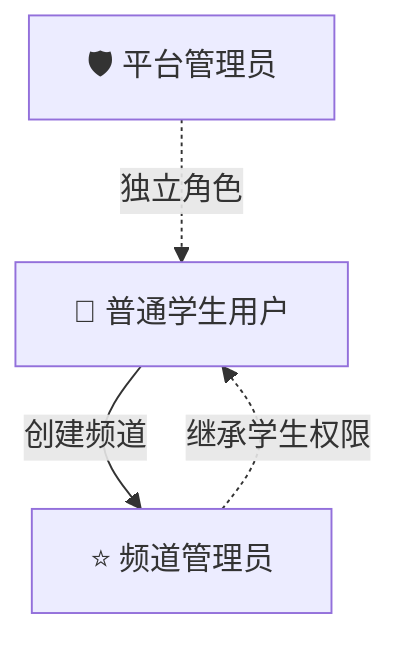

| 功能模块 | 普通学生 | 频道管理员 | 平台管理员 |
|---|:---:|:---:|:---:|
| 注册登录、编辑资料 | ✅ | ✅ | ✅ |
| 发布/删除笔记 | ✅（仅己） | ✅ | ✅ |
| 评论、点赞、收藏 | ✅ | ✅ | ✅ |
| 关注/取关、黑名单 | ✅ | ✅ | ✅ |
| 创建频道 | ✅ | ✅ | ✅ |
| 修改公告、置顶帖子 | ❌ | ✅（仅己） | ✅ |
| 私信群聊 | ✅ | ✅ | ✅ |
| 设置隐私、举报 | ✅ | ✅ | ✅ |
| 审核举报 | ❌ | ❌ | ✅ |

- **普通学生**：核心使用者，校内邮箱注册，创建频道后自动成为管理员
- **频道管理员**：可修改公告和置顶帖子，权限仅限于自己创建的频道
- **平台管理员**：独立角色，负责举报审核，不可查看私密内容

### 1.3 功能需求

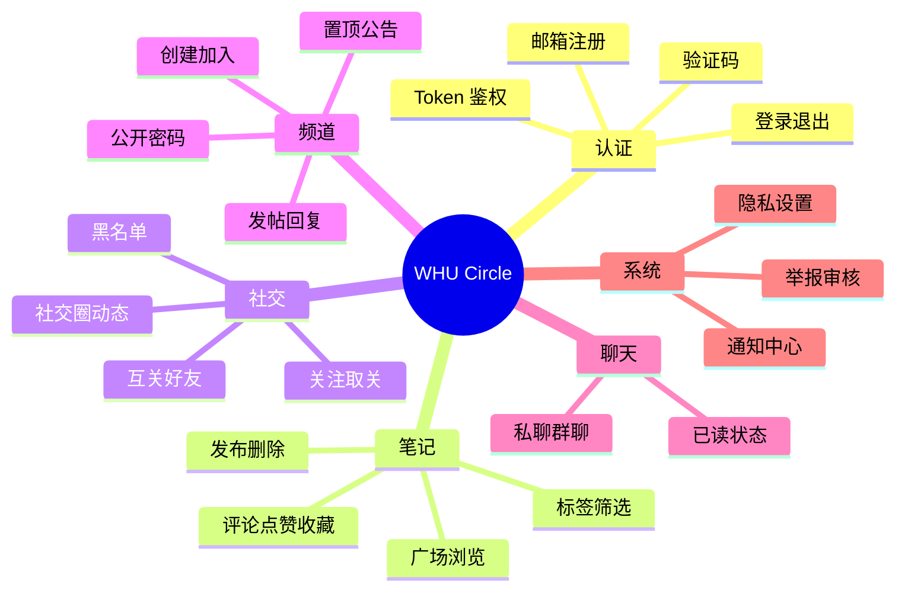

**(1) 用户认证**

- 仅 `@whu.edu.cn` 邮箱可注册
- 验证码 5 分钟有效、60s 冷却、最多 5 次错误
- 密码 BCrypt 哈希存储，登录后签发 Bearer Token
- 除认证接口外所有 API 需要 Token，无效返回 40100

**(2) 笔记系统**

- 发布笔记：标题 ≤100 字，正文必填，校验图片数和标签数
- 可见性：PUBLIC（公开）/ FRIENDS（好友可见）/ PRIVATE（仅自己）
- 首页广场分页展示公开笔记，支持关键词和标签筛选
- 笔记详情按可见性校验：好友可见需互关，私密仅作者本人
- 点赞和收藏支持切换状态；评论 ≤1000 字，被拉黑用户不可评论
- 仅作者可删除笔记（级联删除评论）和评论
- 社交圈仅展示关注用户的笔记
- 标签全局汇总去重排序

**(3) 社交关系**

- 关注为单向操作；若对方已关注我，关系自动变为 FRIEND（互关好友）
- 取关后好友关系自动降级
- 拉黑时自动取关，双向屏蔽主页
- 关系状态：NONE / FOLLOWING / FOLLOWER / FRIEND / BLOCKED

**(4) 频道系统**

- 支持 PUBLIC（公开）和 PASSWORD（密码）两种加入方式
- 创建者自动成为管理员和首位成员
- 仅成员可发帖、回复（≤1000 字）和点赞
- 仅管理员可修改公告和置顶帖子
- 未加入频道可预览最近 5 条帖子

**(5) 即时通讯**

- 支持 PRIVATE（私聊）和 GROUP（群聊）两种会话类型
- 私聊创建时校验黑名单和对方私信权限
- 消息 ≤2000 字，HTTP 请求模式
- 支持消息已读标记
- 会话列表按最后消息时间倒序，显示未读数

**(6) 通知与隐私**

- 笔记被点赞/评论/收藏、频道帖被回复时自动为作者生成通知
- 通知支持分页列表、单条已读、全部已读、未读数角标
- 隐私设置项：默认笔记可见性、默认频道加入方式、私信权限
- 举报目标：NOTE / CHANNEL_POST / MESSAGE / USER
- 举报处理状态：PENDING → RESOLVED / REJECTED

### 1.4 用户故事

| 编号 | 优先级 | 用户故事 | 验收标准 |
|---|:---:|---|---|
| US-01 | P0 | 作为学生，我要用校内邮箱注册账号 | 收到验证码，注册后自动登录 |
| US-02 | P0 | 作为学生，我要发布图文笔记 | 笔记出现在广场和个人主页 |
| US-03 | P0 | 作为学生，我要浏览首页广场 | 分页展示，支持关键词和标签筛选 |
| US-04 | P0 | 作为学生，我要点赞和评论笔记 | 状态切换、评论展示、计数更新 |
| US-05 | P0 | 作为学生，我要关注感兴趣的用户 | 互关后成为好友，可看好友笔记 |
| US-06 | P0 | 作为学生，我要创建和加入频道 | 公开直接加入，密码校验加入 |
| US-07 | P0 | 作为学生，我要和好友私聊 | 发送消息，对方看到未读 |
| US-08 | P1 | 作为学生，我要收藏笔记 | 在"我的收藏"中查看 |
| US-09 | P1 | 作为学生，我要收到互动通知 | 被点赞/评论时出现通知 |
| US-10 | P1 | 作为用户，我要设置隐私和举报 | 修改可见性和私信权限 |
| US-11 | P1 | 作为管理员，我要处理举报 | 查看举报列表，处理或驳回 |

### 1.5 业务流程

**注册与登录**

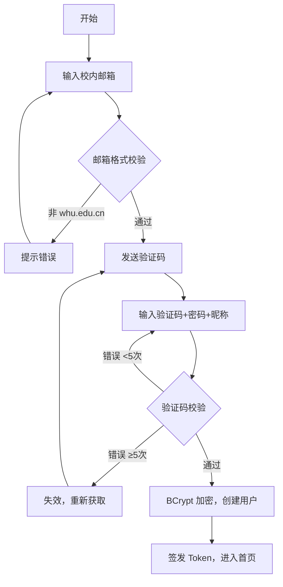

**发布笔记**

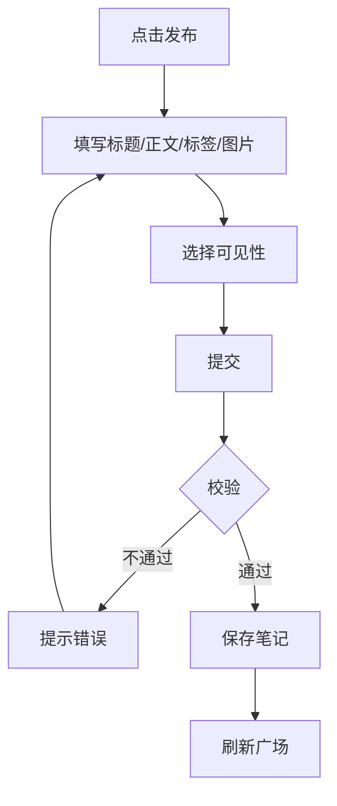

**关注与好友建立**

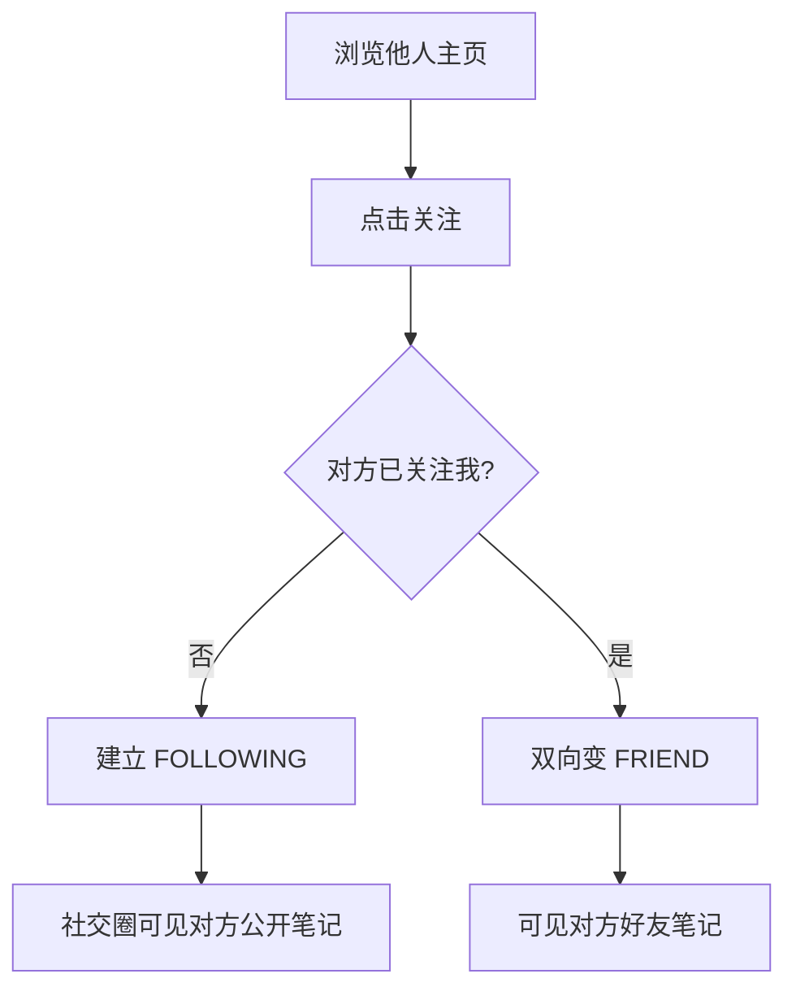

**加入频道**

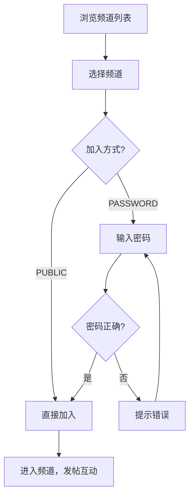

**举报处理**

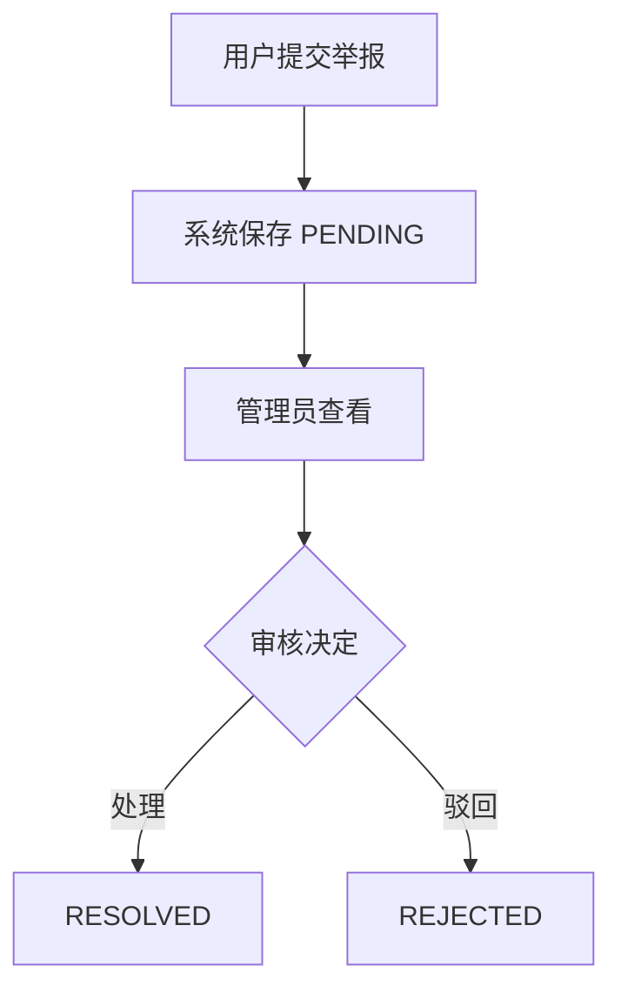

## 二、需求分析建模

### 2.1 用例建模

**用例图**

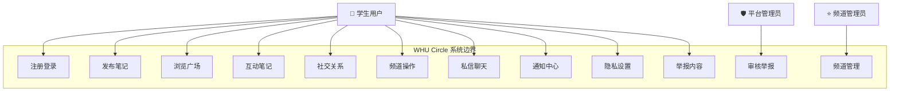

**用例总览**

| 编号 | 用例名称 | 参与者 | 优先级 |
|---|---|---|:---:|
| UC01 | 注册账号 | 学生 | P0 |
| UC02 | 登录/退出 | 学生 | P0 |
| UC03 | 发布笔记 | 学生 | P0 |
| UC04 | 浏览广场 | 学生 | P0 |
| UC05 | 互动笔记（点赞/评论/收藏） | 学生 | P0 |
| UC06 | 管理社交关系（关注/取关/拉黑） | 学生 | P0 |
| UC07 | 创建频道 | 学生 | P0 |
| UC08 | 加入频道并发帖 | 学生 | P0 |
| UC09 | 管理频道（公告/置顶） | 频道管理员 | P1 |
| UC10 | 私信聊天 | 学生 | P0 |
| UC11 | 查看通知 | 学生 | P1 |
| UC12 | 隐私设置 | 学生 | P1 |
| UC13 | 举报内容 | 学生 | P1 |
| UC14 | 审核举报 | 平台管理员 | P1 |

**用例规约（示例）**

*UC01 注册账号*

| 项 | 描述 |
|---|---|
| 参与者 | 未注册学生 |
| 前置条件 | 拥有 `@whu.edu.cn` 邮箱 |
| 后置条件 | 账号创建成功，自动登录 |
| 基本流程 | 1. 输入邮箱 → 2. 发送验证码 → 3. 输入验证码和密码 → 4. 校验通过 → 5. 签发 Token |
| 备选流程 | 验证码错误 <5 次：重新输入；≥5 次：失效重发；60s 内重复请求：提示冷却 |
| 异常流程 | 邮箱已注册 → 40900 |

*UC03 发布笔记*

| 项 | 描述 |
|---|---|
| 参与者 | 已登录学生 |
| 前置条件 | Token 有效 |
| 后置条件 | 笔记保存，出现在广场和个人主页 |
| 基本流程 | 1. 填写标题/正文/标签 → 2. 选择可见性 → 3. 上传图片 → 4. 提交 → 5. 校验 → 6. 保存 |
| 备选流程 | 图片超限：提示限制；标题为空：提示必填 |
| 异常流程 | 未登录 → 跳转登录页 |

### 2.2 顺序建模

**注册与登录**

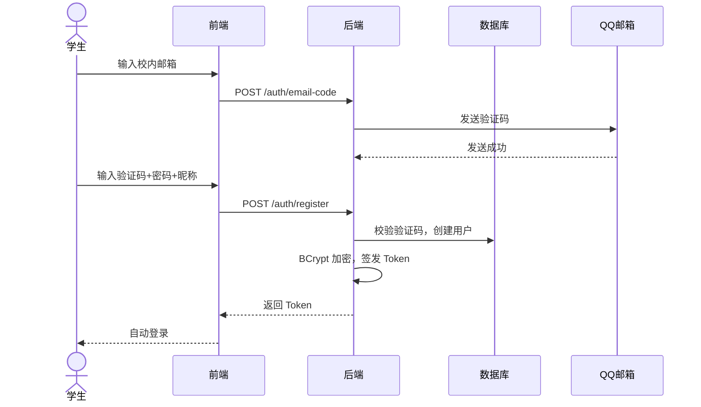

**发布笔记**

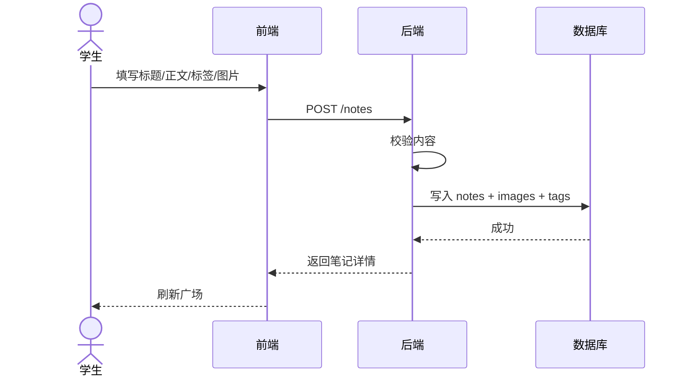

**关注与好友**

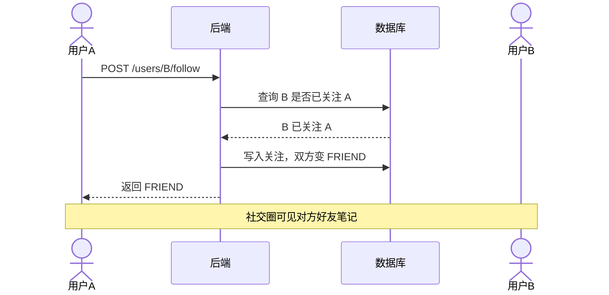

**加入频道并发帖**

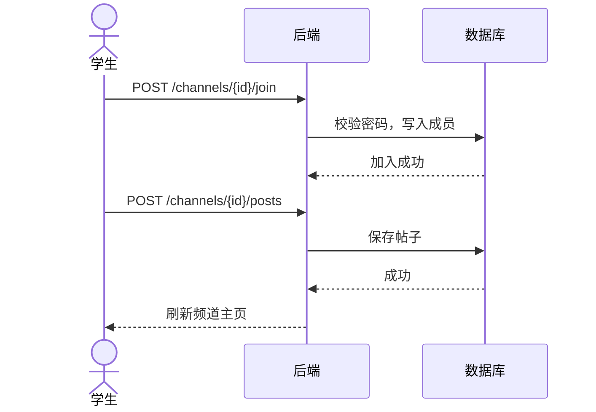

### 2.3 数据流图

**顶层图**

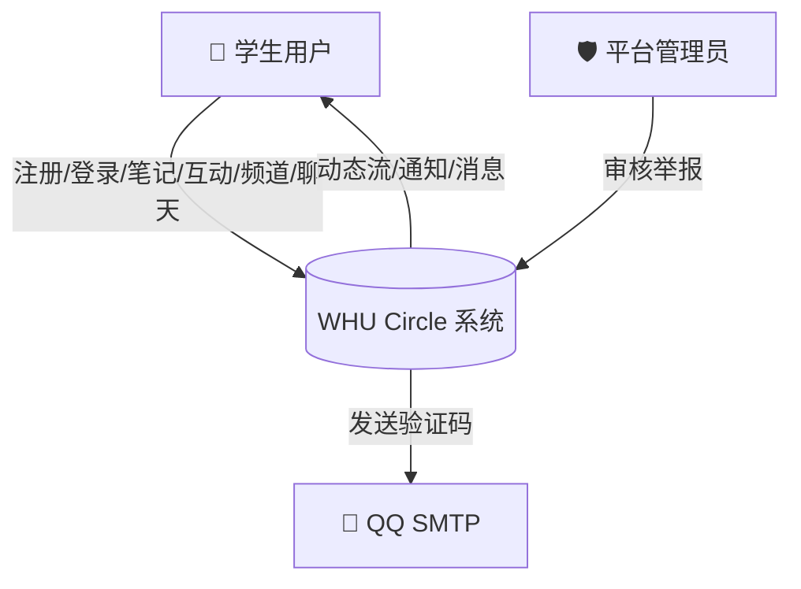

**0 层图**

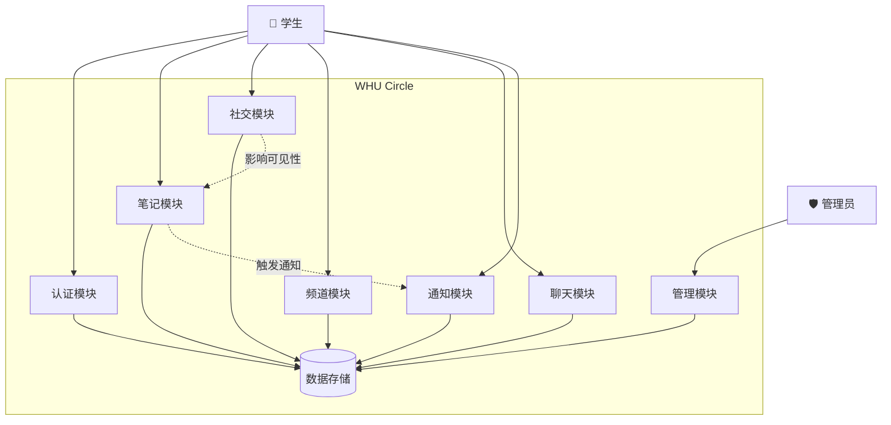

### 2.4 类图

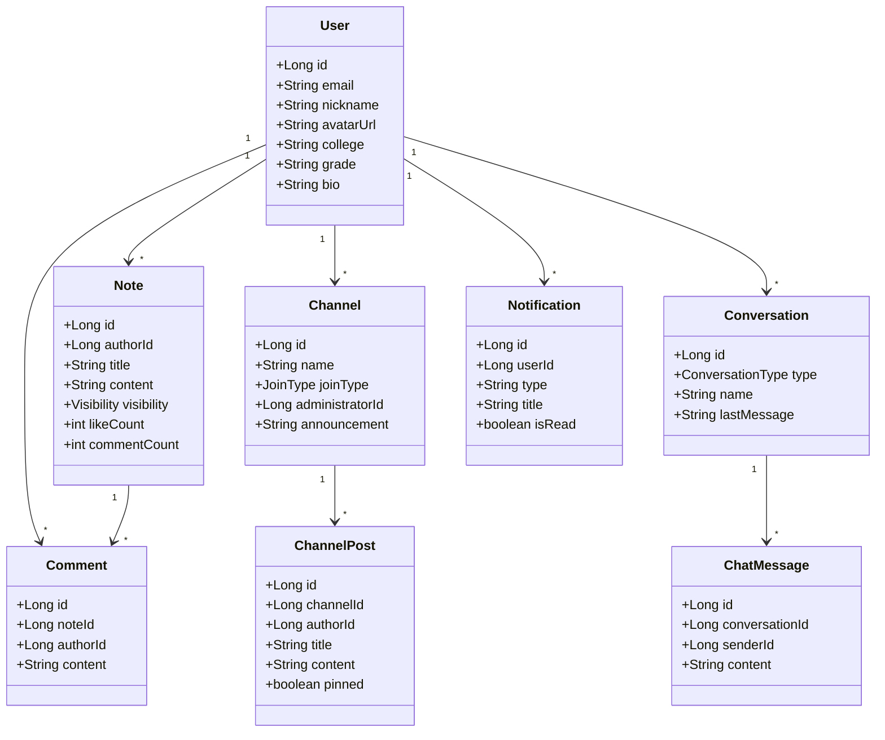

### 2.5 数据建模

**ER 图**

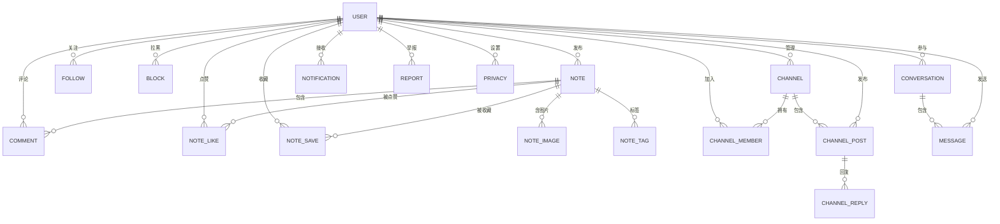

**数据字典**

**核心实体**

| 表 | 关键字段 | 说明 |
|---|---|---|
| users | id(PK), email(UNIQUE), password_hash, nickname, avatar_url, college, grade, bio, created_at | 用户 |
| notes | id(PK), author_id(FK), title, content, visibility(PUBLIC/FRIENDS/PRIVATE), like_count, comment_count | 笔记 |
| comments | id(PK), note_id(FK), author_id(FK), content(VARCHAR 1000) | 评论，级联删除 |
| note_likes | note_id(FK)+user_id(FK) 联合PK | 点赞切换 |
| note_saves | note_id(FK)+user_id(FK) 联合PK | 收藏切换 |
| note_images | id(PK), note_id(FK), image_url, sort_order | 笔记图片 |
| note_tags | note_id(FK)+tag 联合PK | 标签 |

**社交关系**

| 表 | 关键字段 | 说明 |
|---|---|---|
| user_follows | follower_id(FK)+followed_id(FK) 联合PK | CHECK(不能关注自己) |
| user_blocks | blocker_id(FK)+blocked_id(FK) 联合PK | CHECK(不能拉黑自己) |

**频道**

| 表 | 关键字段 | 说明 |
|---|---|---|
| channels | id(PK), name, join_type(PUBLIC/PASSWORD), password_hash, administrator_id(FK), announcement, member_count | 管理员不级联删除 |
| channel_members | channel_id(FK)+user_id(FK) 联合PK, role(ADMIN/MEMBER) | |
| channel_posts | id(PK), channel_id(FK), author_id(FK), title, content, pinned, like_count, reply_count | 置顶优先排序 |
| channel_replies | id(PK), post_id(FK), author_id(FK), content(VARCHAR 1000) | |
| channel_post_likes | post_id(FK)+user_id(FK) 联合PK | |

**消息、通知与系统**

| 表 | 关键字段 | 说明 |
|---|---|---|
| conversations | id(PK), type(PRIVATE/GROUP), name, last_message, last_message_at | |
| conversation_members | conversation_id(FK)+user_id(FK) 联合PK | |
| messages | id(PK), conversation_id(FK), sender_id(FK), content(VARCHAR 2000), sent_at | |
| message_read_status | message_id(FK)+user_id(FK) 联合PK | 已读标记 |
| notifications | id(PK), user_id(FK), type, title, content, target_id, is_read | |
| reports | id(PK), reporter_id(FK), target_type, target_id, reason, status(PENDING/RESOLVED/REJECTED) | |
| privacy_settings | user_id(PK+FK), default_note_visibility, default_channel_join_type, direct_message_permission | 一对一用户 |
| email_verification_codes | id(PK), email, code_hash, expires_at, attempts | 验证码安全 |

**枚举汇总**

| 枚举 | 取值 |
|---|---|
| 笔记可见性 | PUBLIC / FRIENDS / PRIVATE |
| 频道加入方式 | PUBLIC / PASSWORD |
| 会话类型 | PRIVATE / GROUP |
| 私信权限 | EVERYONE / FRIENDS_ONLY / NONE |
| 关系状态 | NONE / FOLLOWING / FOLLOWER / FRIEND / BLOCKED |
| 举报状态 | PENDING / RESOLVED / REJECTED |

**状态图**

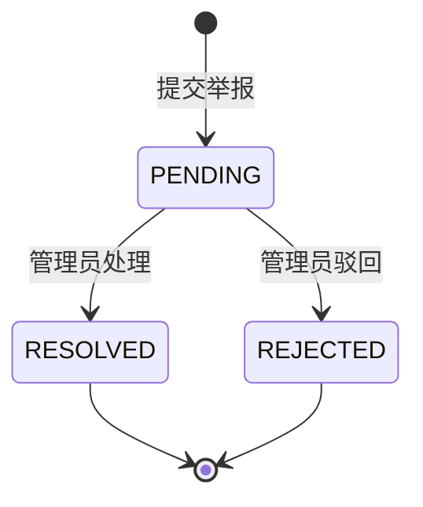

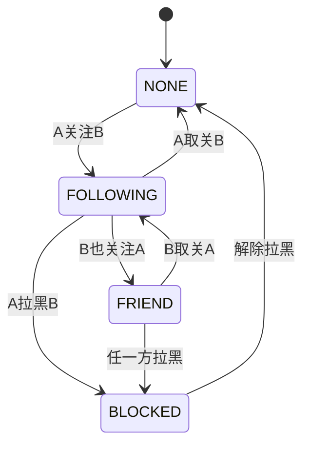

## 三、非功能性需求说明

### 3.1 开发与运行环境

| 层级 | 技术 | 版本 |
|---|---|---|
| 前端 | React + Vite | React 19 / Vite 6 |
| 后端 | Spring Boot | 3.5.16 / JDK 17 |
| 数据库 | MySQL | 8.4（Docker） |
| API 文档 | springdoc-openapi | 2.8.17 |
| 构建 | Maven 3.9 / npm | |

| 服务 | 地址 |
|---|---|
| 前端 | `http://127.0.0.1:5173` |
| 后端 API | `http://127.0.0.1:8080/api/v1` |
| Swagger | `http://127.0.0.1:8080/swagger-ui/index.html` |

### 3.2 系统依赖

- MySQL 8.4（Docker Compose，utf8mb4 字符集）
- QQ 邮箱 SMTP（验证码发送，`smtp.qq.com:465` SSL）
- 不依赖 Redis / Nginx / 消息队列 / 对象存储

### 3.3 安全性

- 密码 BCrypt 哈希存储
- Bearer Token 接口鉴权（认证接口外全量拦截）
- 用户仅可操作自己的资源；频道管理员权限限于自己频道
- 前后端双重输入校验（长度、格式、枚举）
- MyBatis 参数化查询防 SQL 注入

错误码：

| code | 含义 |
|---:|---|
| 40000 | 参数格式错误 |
| 40001 | 邮箱或密码错误 |
| 40002 | 验证码错误或过期 |
| 40100 | 未登录或 Token 无效 |
| 40300 | 无权限或被拉黑 |
| 40302 | 未加入频道 |
| 40400 | 资源不存在 |
| 40900 | 邮箱已注册 |
| 50000 | 服务端异常 |

### 3.4 性能与可用性

- 首页首屏 < 2s（本地环境），列表分页 20 条/页
- 图片懒加载
- 兼容 Chrome / Edge 桌面端，桌面端优先布局
- JSON 响应，字段小驼峰，时间 ISO 8601
- 双 Profile：mock（内存演示）/ mysql（持久化），通过 Spring Profile 切换

## 四、扩展功能思考

当前版本完成了校园社交的核心闭环，以下方向可作为后续迭代参考：

- **站内智能助手**：接入 Agent，支持自然语言查询校园信息（如"最近有什么活动""帮我找二手教材"），降低信息获取门槛
- **校园话题热榜**：基于笔记和频道帖子热度自动生成趋势榜单
- **内容推荐优化**：从标签筛选升级为基于用户兴趣的协同过滤
- **活动报名系统**：频道内嵌活动发布与报名功能，打通社交与线下场景
