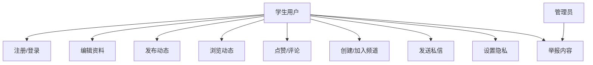
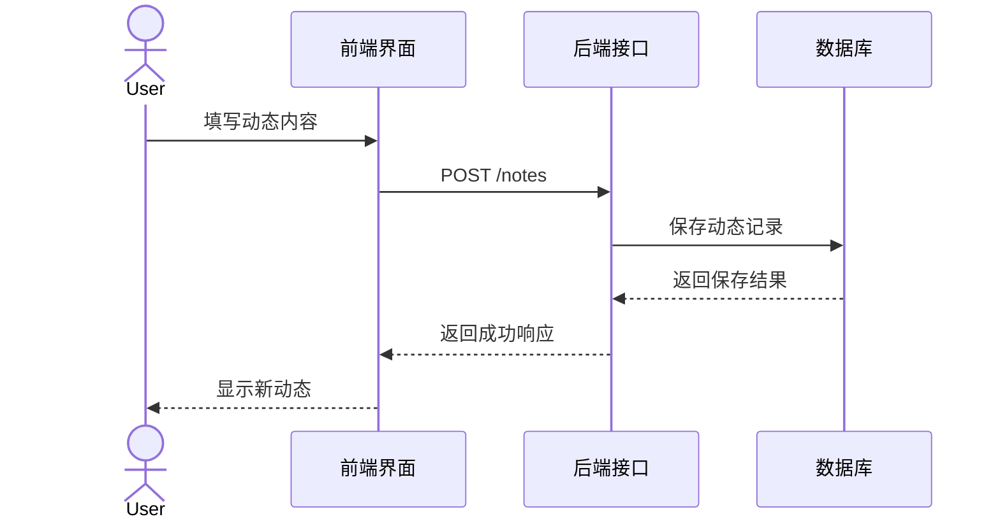
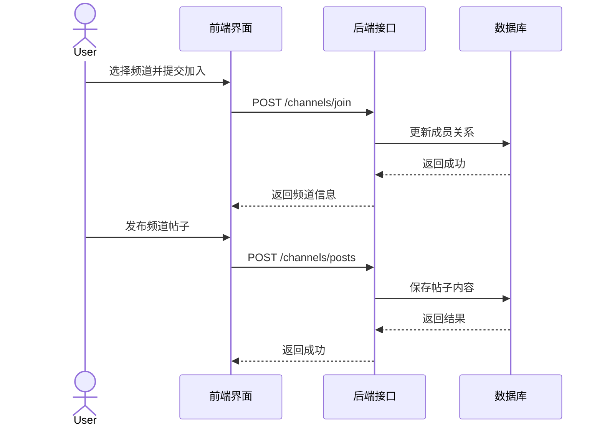
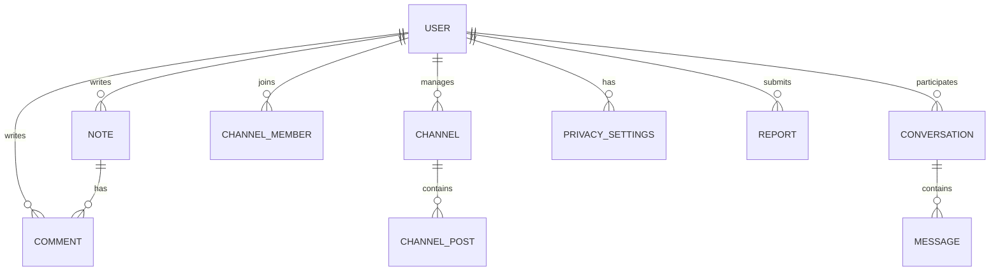

# WHU Circle 需求建模文档

## 1. 项目概述

WHU Circle 是一个面向武大校园场景的轻量级社交媒体原型系统，目标是为学生提供一个集中、便捷、低门槛的内容发布与社交互动平台。系统支持动态分享、兴趣频道交流、私信沟通、个人主页展示和隐私设置，帮助校园用户在同一个入口中完成信息传播与社交互动。

## 2. 业务目标

本项目的核心目标是实现一个可演示、可扩展的校园社交原型，重点覆盖以下业务能力：

- 学生用户完成注册、登录与身份认证
- 用户发布个人动态并进行内容展示
- 用户浏览动态广场并与他人进行互动
- 用户加入或创建兴趣频道并在频道内发帖
- 用户与好友进行私信或群聊沟通
- 用户管理个人资料、隐私权限与社交关系

## 3. 范围说明

### 3.1 在范围内
- 校内邮箱注册与登录
- 个人资料编辑
- 动态发布、浏览、评论与点赞
- 频道创建、加入与发帖
- 私信与聊天消息
- 隐私设置与内容举报

### 3.2 不在本版本范围内
- 实时音视频通话
- 大规模推荐算法
- 复杂内容审核后台
- 电商、支付、校园活动报名等扩展功能

## 4. 用户角色

### 4.1 普通学生用户
主要使用系统进行内容发布、浏览信息、加入频道、发送消息和管理个人资料。

### 4.2 频道管理员
负责创建频道、发布频道公告、管理频道成员和维护频道内容。

### 4.3 平台管理员
负责用户管理、内容审核、举报处理和系统维护。

## 5. 功能需求

### 5.1 用户认证与账户管理
- 用户可以通过校内邮箱注册账号
- 用户可以登录与退出系统
- 系统需要保证用户身份的基本验证与访问控制

### 5.2 个人主页与资料管理
- 用户可以填写昵称、学院、年级、头像链接与个人简介
- 用户可以编辑个人资料并查看自己的主页内容

### 5.3 动态发布与浏览
- 用户可以发布动态内容，包括标题、正文、标签和图片标记
- 用户可以浏览首页动态流
- 用户可以对动态进行点赞与评论

### 5.4 频道管理
- 用户可以创建频道
- 用户可以加入公开频道或使用密码加入受保护频道
- 用户可以在频道内发布帖子并查看频道公告

### 5.5 消息与聊天
- 用户可以与他人进行私信或群聊
- 系统需要支持消息发送、未读状态和已读处理

### 5.6 隐私与安全
- 用户可以设置动态可见性、频道加入方式与私信权限
- 系统应对敏感操作进行权限校验

## 6. 用户故事

- 作为学生用户，我希望能够发布自己的学习和生活动态，以便与同学分享。
- 作为学生用户，我希望能够加入感兴趣的校园频道，参与讨论和获取信息。
- 作为用户，我希望能够通过私信与好友进行更私密的交流。
- 作为用户，我希望能控制自己的资料和动态可见范围，保护个人隐私。
- 作为管理员，我希望能处理举报内容，维护平台秩序。

## 7. 业务流程

### 7.1 发布动态流程
1. 用户登录系统
2. 进入首页或个人主页
3. 填写动态内容
4. 提交发布
5. 系统保存动态并显示到动态流中

### 7.2 加入频道并发帖流程
1. 用户浏览频道列表
2. 选择目标频道并加入
3. 输入帖子内容
4. 提交后系统保存帖子并同步到频道页面

### 7.3 发送私信流程
1. 用户选择聊天对象
2. 输入消息内容
3. 系统保存消息并更新对话记录
4. 对方收到消息并显示未读状态

## 8. 用例建模

### 8.1 用例列表
- UC01 注册与登录
- UC02 编辑个人资料
- UC03 发布动态
- UC04 浏览动态流
- UC05 点赞与评论
- UC06 创建频道
- UC07 加入频道
- UC08 发布频道帖子
- UC09 发送私信
- UC10 设置隐私
- UC11 举报内容

### 8.2 用例图

## 9. 顺序建模

### 9.1 发布动态序列图

### 9.2 加入频道并发帖序列图

## 10. 数据建模

### 10.1 ER 图

### 10.2 数据字典

| 实体 | 关键字段 | 说明 |
| --- | --- | --- |
| User | id, email, nickname, passwordHash, avatarUrl, college, grade, bio | 用户基础信息 |
| Note | id, authorId, title, content, visibility, tags, likeCount, commentCount | 用户动态内容 |
| Comment | id, noteId, authorId, content, createdAt | 动态评论 |
| Channel | id, name, joinType, password, administratorId, announcement | 频道信息 |
| ChannelPost | id, channelId, authorId, title, content, tags, pinned | 频道帖子 |
| Conversation | id, type, name, memberIds, lastMessage, lastMessageAt | 对话/群聊 |
| Message | id, conversationId, senderId, content, createdAt | 聊天消息 |
| PrivacySettings | defaultNoteVisibility, defaultChannelJoinType, directMessagePermission | 用户隐私设置 |
| Report | id, reporterId, targetType, targetId, reason, status | 内容举报记录 |

## 11. 非功能需求

### 11.1 安全性
- 用户密码应进行哈希存储
- 需要对敏感接口进行身份校验
- 需要防止越权访问与异常输入

### 11.2 性能
- 页面加载与交互应保持流畅
- 动态流和聊天列表应支持较快的数据展示
- 在本地开发环境下应满足基础演示需求

### 11.3 可用性
- 界面应清晰、易操作、兼容主流浏览器
- 重点流程应减少用户操作步骤

### 11.4 可维护性
- 前后端模块应尽量解耦
- 关键业务逻辑应有清晰的接口和数据模型定义
- 文档与代码结构应便于后续迭代

### 11.5 部署与环境
- 前端可基于 Vite 运行
- 后端可基于 Spring Boot 提供接口
- 可选使用 MySQL 作为持久化数据库
- 适合在开发机或云服务器上部署演示环境

## 12. 验收标准

系统达到以下条件时可视为基本完成：

- 用户可以完成注册与登录
- 用户可以发布并查看动态
- 用户可以点赞、评论并进行基础互动
- 用户可以创建或加入频道并发布帖子
- 用户可以进行私信或群聊
- 用户可以编辑资料并设置隐私规则
- 系统具备基本的错误提示与权限控制
