# WHU Circle 系统设计说明书

## 1. 文档概述

### 1.1 项目名称

WHU Circle（武大校园圈）

### 1.2 项目定位

WHU Circle 是面向武汉大学校内用户的校园社交平台原型系统。系统围绕校内邮箱注册登录、校园笔记发布、好友关系、频道讨论、聊天消息、通知提醒、隐私设置、举报反馈和全站管理员治理等功能展开。

当前项目采用前后端分离结构：

- 前端：React + Vite 单页应用。
- 后端：Spring Boot REST API。
- 数据库：MySQL，提供持久化数据存储。
- 联调模式：支持 `mock` 内存模式和 `mysql` 持久化模式。

### 1.3 当前开发进度

当前已实现并接入的主要能力：

- 校内邮箱注册、登录、验证码、找回密码、退出登录。
- 笔记列表、发布笔记、笔记详情、评论、点赞、收藏、删除笔记、删除评论。
- 社交圈、关注/取消关注、拉黑/取消拉黑、好友关系展示。
- 频道列表、创建频道、加入频道、频道帖子、帖子回复、帖子点赞、帖子置顶、频道公告修改。
- 聊天会话列表、创建会话、发送消息、已读标记。
- 通知列表、单条已读、全部已读、未读数量。
- 个人资料编辑、隐私设置。
- 举报入口。
- 图片上传到后端本地目录，并以 `/uploads/images/...` URL 返回。
- 全站管理员入口、用户封禁/解封、频道封禁/解封、删除笔记、删除频道帖子。
- MySQL 建表脚本、演示数据脚本和管理员迁移脚本。

仍处于原型或后续增强阶段的能力：

- 频道管理员体系尚未完整展开，目前频道只有创建者/管理员基础权限。
- 图片目前存储在运行后端的本机目录，适合本地联调；如果部署到多机或云端，需要接入对象存储或共享文件存储。
- 推荐系统目前以规则和反馈记录为主，还不是完整机器学习推荐系统。

## 2. 系统体系架构

### 2.1 总体架构

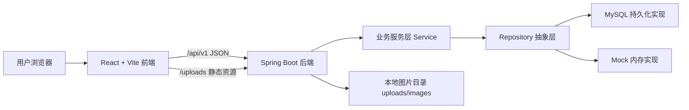

系统采用浏览器、前端、后端、数据库的四层结构。前端负责页面展示、交互状态和 API 调用；后端负责认证鉴权、业务规则和数据读写；数据库保存用户、笔记、评论、关系、频道、聊天、通知等持久化数据；图片文件保存在后端本地目录。

### 2.2 前端架构

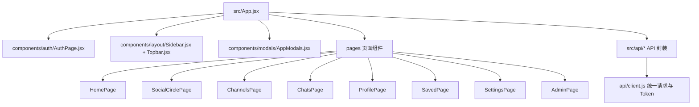

前端当前是单页应用。`App.jsx` 维护登录状态、页面导航状态、业务数据状态和弹窗状态。各页面组件负责具体界面展示；`src/api` 目录封装后端接口；`api/client.js` 统一处理请求路径、JSON 响应、错误和 Bearer Token。

### 2.3 后端架构

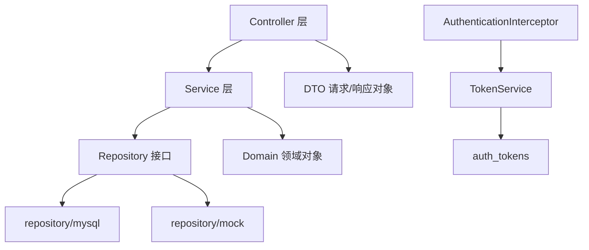

后端采用典型分层结构：

- Controller：接收 HTTP 请求，读取 `CurrentUser`，返回统一 `ApiResponse`。
- Service：实现业务规则，例如可见性、拉黑关系、频道成员校验、管理员校验。
- Repository：定义数据访问接口。
- repository/mysql：MySQL 持久化实现。
- repository/mock：内存实现，用于快速预览和测试。
- Domain：领域对象，如 `User`、`Note`、`Channel`、`Conversation`。
- DTO：接口输入输出对象。
- Security：通过 `AuthenticationInterceptor` 校验 Bearer Token。

### 2.4 部署与联调架构

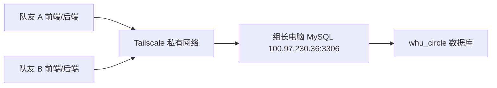

当前团队联调采用共享数据库模式：每位成员本机运行前端和后端，后端通过 Tailscale 连接组长电脑上的 MySQL。这样可以共享同一份业务数据，便于测试真实网站形态。

## 3. 系统功能结构

### 3.1 功能层次结构

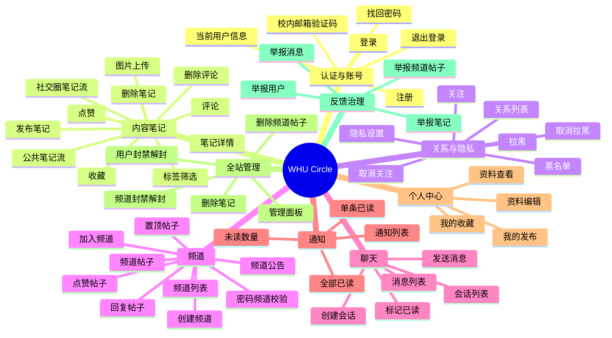

### 3.2 角色功能说明

| 角色 | 说明 | 当前功能 |
| --- | --- | --- |
| 游客 | 未登录用户 | 只能访问登录、注册、找回密码页面 |
| 普通用户 | 校内邮箱注册用户 | 使用笔记、社交、频道、聊天、通知、设置等功能 |
| 频道管理员 | 当前为频道创建者/管理员基础模型 | 可修改频道公告、置顶频道帖子 |
| 全站管理员 | `users.role = ADMIN` | 访问全站管理面板，封禁用户/频道，删除笔记/频道帖子 |

## 4. 系统用例时序图与说明

### 4.1 登录用例

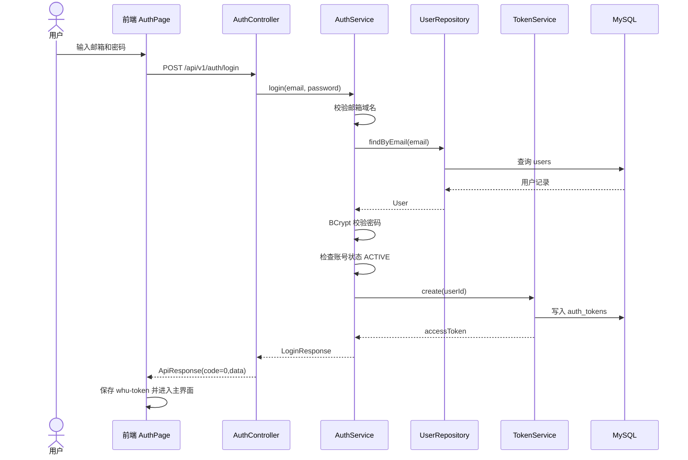

说明：登录时后端会先校验邮箱域名，再查找用户、校验密码、检查是否被封禁。如果通过，则生成 access token。前端把 token 存入 `localStorage`，之后所有 API 请求都带上 `Authorization: Bearer <token>`。

### 4.2 发布笔记与图片上传用例

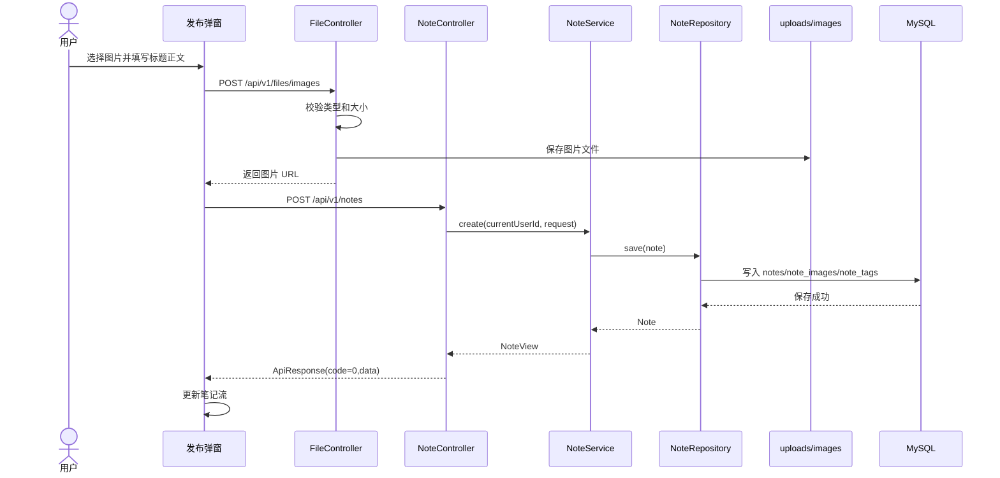

说明：图片上传和笔记创建是两个接口。前端先上传图片拿到 URL，再把 URL 列表随笔记正文提交给后端。后端保存图片时按年月分目录，并使用 UUID 文件名避免重名。

### 4.3 查看社交圈笔记用例

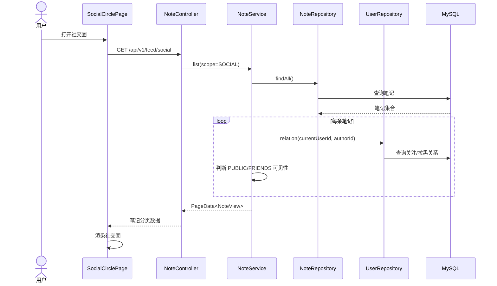

说明：社交圈不是简单返回全部笔记。后端会判断当前用户是否关注作者，是否互相关注，是否存在拉黑关系，以及笔记本身是公开还是好友可见。

### 4.4 加入频道与发帖用例

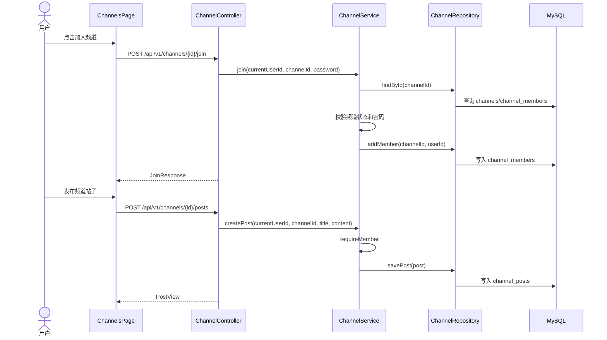

说明：加入密码频道时必须提交正确密码。发布频道帖子前，后端会确认当前用户是频道成员。

### 4.5 全站管理员治理用例

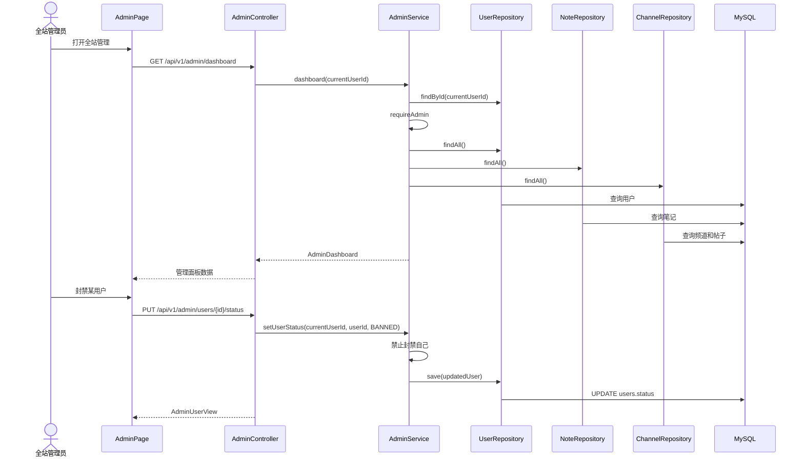

说明：全站管理入口只对 `role = ADMIN` 的用户展示。后端每个管理员接口都会再次执行 `requireAdmin`，防止普通用户绕过前端直接访问管理接口。

## 5. 复杂功能算法设计

### 5.1 笔记可见性算法

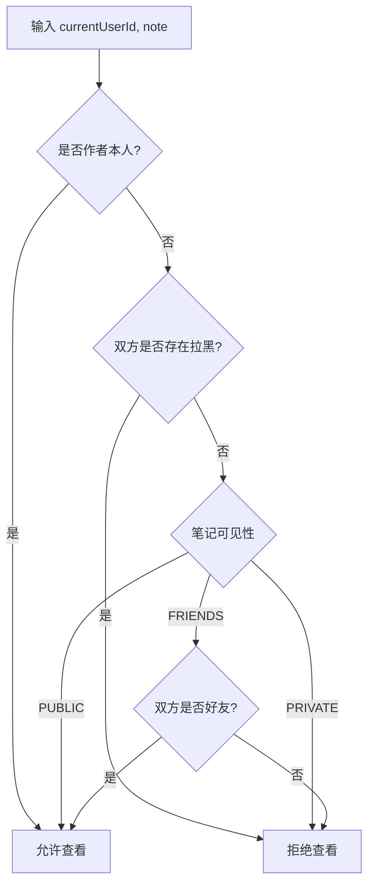

伪码：

```text
function canView(currentUserId, note):
    if note.authorId == currentUserId:
        return true

    if users.isBlockedEitherWay(currentUserId, note.authorId):
        return false

    if note.visibility == PUBLIC:
        return true

    if note.visibility == FRIENDS:
        return users.relation(currentUserId, note.authorId) == FRIEND

    return false
```

设计说明：该算法集中在 `NoteService` 中，用于笔记详情、评论列表、点赞、收藏、社交圈等场景，保证前端无法绕过权限直接获取不可见笔记。

### 5.2 社交圈筛选算法

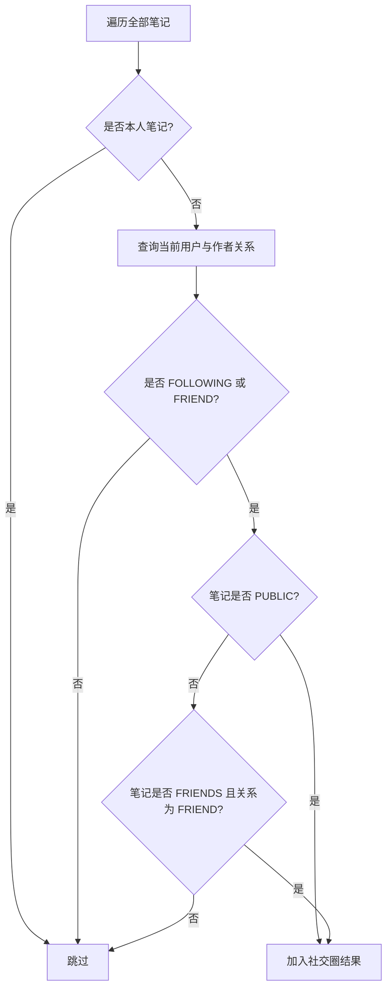

伪码：

```text
function isSocialVisible(currentUserId, note):
    if note.authorId == currentUserId:
        return false

    relation = users.relation(currentUserId, note.authorId)
    if relation not in [FOLLOWING, FRIEND]:
        return false

    if note.visibility == PUBLIC:
        return true

    return note.visibility == FRIENDS and relation == FRIEND
```

设计说明：社交圈强调“我关注的人”和“好友可见”。普通关注可以看到公开笔记，互相关注形成好友后才能看到好友可见笔记。

### 5.3 频道加入算法

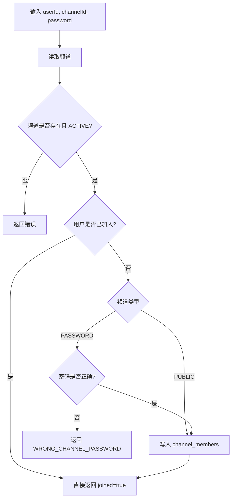

伪码：

```text
function join(userId, channelId, password):
    channel = requireChannel(channelId)
    if userId in channel.memberIds:
        return JoinResponse(true, channel.memberCount)

    if channel.joinType == PASSWORD and channel.password != password:
        throw WRONG_CHANNEL_PASSWORD

    updated = channels.addMember(channelId, userId)
    return JoinResponse(true, updated.memberCount)
```

设计说明：频道分公开频道和密码频道。无论前端如何显示，后端都以频道状态、成员关系和密码校验作为最终依据。

### 5.4 管理员权限算法

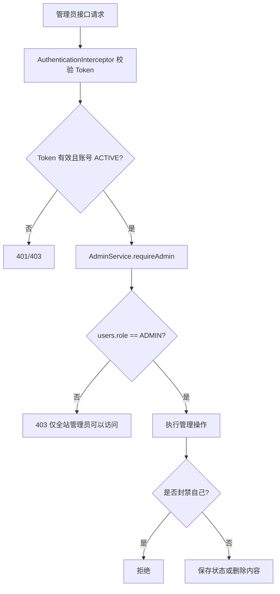

伪码：

```text
function requireAdmin(currentUserId):
    user = users.findById(currentUserId)
    if user.role != ADMIN:
        throw FORBIDDEN

function setUserStatus(currentUserId, userId, status):
    requireAdmin(currentUserId)
    if currentUserId == userId and status == BANNED:
        throw BAD_REQUEST
    user = requireUser(userId)
    users.save(user with status)
```

设计说明：管理员权限同时由前端展示控制和后端强制校验保证。即使普通用户伪造请求，也会在 `AdminService.requireAdmin` 被拒绝。

### 5.5 图片上传算法

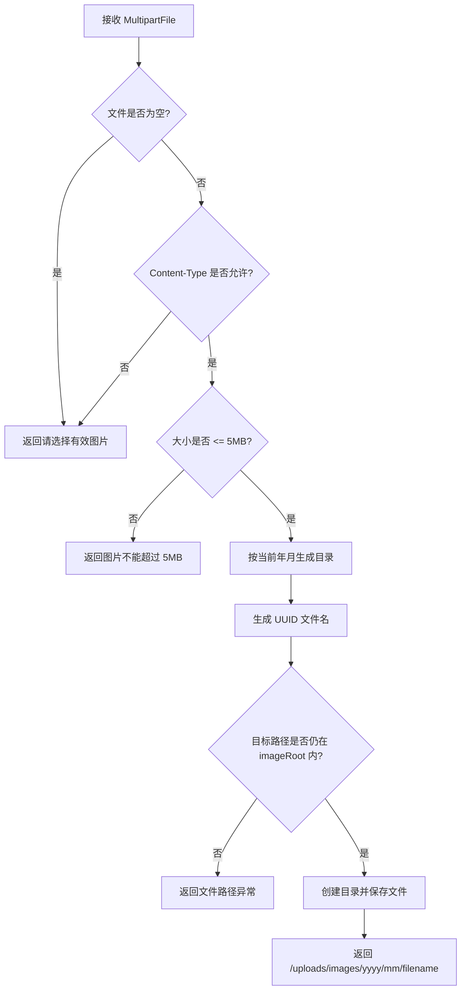

伪码：

```text
function upload(file):
    if file.empty or file.contentType not in ALLOWED_TYPES:
        throw BAD_REQUEST
    if file.size > 5MB:
        throw BAD_REQUEST

    relativeDir = year/month
    filename = uuid + safeExtension(file)
    target = imageRoot.resolve(relativeDir).resolve(filename).normalize()
    if not target.startsWith(imageRoot):
        throw BAD_REQUEST

    createDirectories(target.parent)
    transferTo(target)
    return "/uploads/images/" + relativeDir + "/" + filename
```

设计说明：该算法避免原始文件名冲突，并通过 `normalize` 和 `startsWith` 防止路径穿越。当前文件保存在后端本机，后续部署可替换为对象存储。

## 6. 面向对象方法类图详细设计

### 6.1 后端核心类图

```mermaid
classDiagram
    class AuthController
    class NoteController
    class ChannelController
    class ChatController
    class UserController
    class AdminController
    class FileController

    class AuthService
    class NoteService
    class ChannelService
    class ChatService
    class UserService
    class AdminService
    class NotificationService
    class SettingsService
    class ReportService
    class TokenService

    class UserRepository
    class NoteRepository
    class ChannelRepository
    class ChatRepository
    class NotificationRepository
    class SettingsRepository

    AuthController --> AuthService
    NoteController --> NoteService
    ChannelController --> ChannelService
    ChatController --> ChatService
    UserController --> UserService
    AdminController --> AdminService
    FileController --> "local file storage"

    AuthService --> UserRepository
    AuthService --> TokenService
    NoteService --> NoteRepository
    NoteService --> UserRepository
    NoteService --> NotificationRepository
    ChannelService --> ChannelRepository
    ChannelService --> UserRepository
    ChannelService --> NotificationRepository
    ChatService --> ChatRepository
    ChatService --> UserRepository
    AdminService --> UserRepository
    AdminService --> NoteRepository
    AdminService --> ChannelRepository
    NotificationService --> NotificationRepository
    SettingsService --> SettingsRepository
    ReportService --> UserRepository
```

### 6.2 领域对象类图

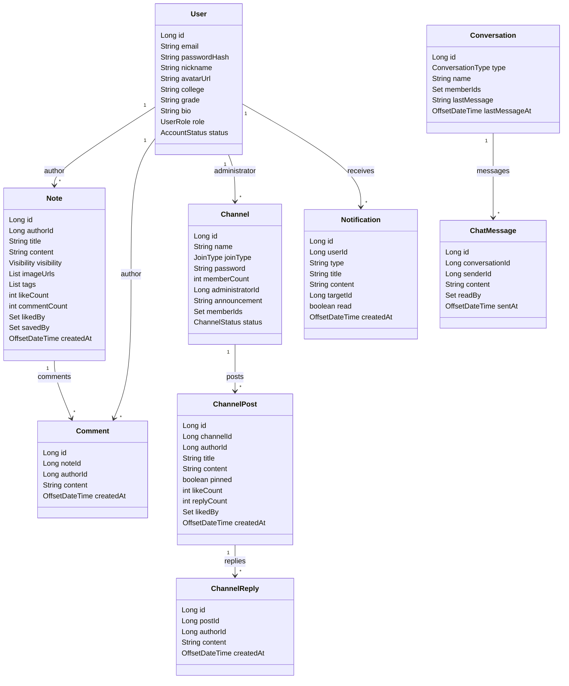

### 6.3 前端组件结构图

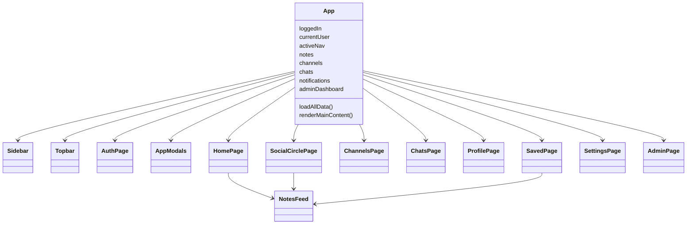

## 7. 接口设计

### 7.1 通用接口规范

基础路径：

```text
/api/v1
```

通用响应：

```json
{
  "code": 0,
  "message": "success",
  "data": {}
}
```

认证方式：

```http
Authorization: Bearer <accessToken>
```

除登录、注册、验证码、健康检查等公开接口外，其余接口需要 Bearer Token。

分页响应使用 `PageData<T>`，主要包含列表数据、页码、每页数量和总量等分页信息。

### 7.2 认证接口

| 方法 | 路径 | 说明 | 请求体/参数 | 响应 |
| --- | --- | --- | --- | --- |
| POST | `/auth/email-code` | 发送验证码 | `email`, `scene` | `EmailCodeResponse` |
| POST | `/auth/send-code` | 兼容验证码接口 | `email`, `scene` | `EmailCodeResponse` |
| POST | `/auth/register` | 注册 | `email`, `code`, `password`, `nickname` | `LoginResponse` |
| POST | `/auth/login` | 登录 | `email`, `password` | `LoginResponse` |
| POST | `/auth/reset-password` | 找回密码 | `email`, `code`, `newPassword` | 空 |
| GET | `/auth/me` | 当前用户信息 | Token | `UserView` |
| POST | `/auth/logout` | 退出登录 | Token | 空 |

### 7.3 用户与关系接口

| 方法 | 路径 | 说明 |
| --- | --- | --- |
| GET | `/users/me/profile` | 获取当前用户个人资料 |
| PUT | `/users/me/profile` | 修改当前用户个人资料 |
| GET | `/relations` | 获取关注、好友等关系 |
| GET | `/users/{userId}` | 查看用户资料 |
| POST | `/users/{userId}/follow` | 关注用户 |
| DELETE | `/users/{userId}/follow` | 取消关注 |
| POST | `/users/{userId}/block` | 拉黑用户 |
| DELETE | `/users/{userId}/block` | 取消拉黑 |
| GET | `/blocks` | 获取黑名单 |

### 7.4 笔记接口

| 方法 | 路径 | 说明 |
| --- | --- | --- |
| GET | `/notes` | 获取笔记列表，支持 scope、keyword、tag、page、size |
| POST | `/notes` | 发布笔记 |
| GET | `/notes/{noteId}` | 获取笔记详情 |
| GET | `/notes/{noteId}/comments` | 获取评论 |
| POST | `/notes/{noteId}/comments` | 发布评论 |
| POST | `/notes/{noteId}/like` | 点赞/取消点赞 |
| POST | `/notes/{noteId}/save` | 收藏/取消收藏 |
| GET | `/feed/social` | 社交圈笔记流 |
| GET | `/tags` | 标签列表 |
| DELETE | `/notes/{noteId}` | 删除自己的笔记 |
| DELETE | `/notes/{noteId}/comments/{commentId}` | 删除自己的评论 |

### 7.5 频道接口

| 方法 | 路径 | 说明 |
| --- | --- | --- |
| GET | `/channels` | 频道列表，支持 joined、keyword、page、size |
| GET | `/channels/{channelId}` | 频道详情 |
| POST | `/channels` | 创建频道 |
| PUT | `/channels/{channelId}/announcement` | 修改频道公告 |
| POST | `/channels/{channelId}/join` | 加入频道 |
| GET | `/channels/{channelId}/posts` | 频道帖子列表 |
| POST | `/channels/{channelId}/posts` | 发布频道帖子 |
| GET | `/channel-posts/{postId}` | 频道帖子详情 |
| POST | `/channel-posts/{postId}/replies` | 回复频道帖子 |
| POST | `/channel-posts/{postId}/like` | 点赞/取消点赞频道帖子 |
| PUT | `/channel-posts/{postId}/pin` | 置顶/取消置顶频道帖子 |

### 7.6 聊天接口

| 方法 | 路径 | 说明 |
| --- | --- | --- |
| GET | `/conversations` | 会话列表 |
| POST | `/conversations` | 创建私聊或群聊会话 |
| GET | `/conversations/{conversationId}/messages` | 消息列表 |
| POST | `/conversations/{conversationId}/messages` | 发送消息 |
| PUT | `/conversations/{conversationId}/read` | 标记会话已读 |

### 7.7 通知接口

| 方法 | 路径 | 说明 |
| --- | --- | --- |
| GET | `/notifications` | 通知列表 |
| GET | `/notifications/count` | 未读数量 |
| PUT | `/notifications/{notificationId}/read` | 单条通知已读 |
| PUT | `/notifications/read-all` | 全部通知已读 |

### 7.8 设置、举报、推荐和文件接口

| 方法 | 路径 | 说明 |
| --- | --- | --- |
| GET | `/settings/privacy` | 获取隐私设置 |
| PUT | `/settings/privacy` | 修改隐私设置 |
| POST | `/reports` | 提交举报 |
| GET | `/recommendations/home` | 首页推荐 |
| GET | `/recommendations/notes` | 笔记推荐 |
| GET | `/recommendations/users` | 用户推荐 |
| GET | `/recommendations/channels` | 频道推荐 |
| POST | `/recommendations/feedback` | 推荐反馈 |
| POST | `/files/images` | 上传图片，`multipart/form-data` |
| GET | `/health` | 健康检查 |

### 7.9 全站管理员接口

| 方法 | 路径 | 说明 |
| --- | --- | --- |
| GET | `/admin/dashboard` | 获取全站管理面板 |
| PUT | `/admin/users/{userId}/status` | 封禁/解封用户 |
| PUT | `/admin/channels/{channelId}/status` | 封禁/解封频道 |
| DELETE | `/admin/notes/{noteId}` | 管理员删除笔记 |
| DELETE | `/admin/channel-posts/{postId}` | 管理员删除频道帖子 |

## 8. 数据库物理设计

### 8.1 数据库基本信息

| 项目 | 设计 |
| --- | --- |
| 数据库 | `whu_circle` |
| 字符集 | `utf8mb4` |
| 排序规则 | `utf8mb4_0900_ai_ci` |
| 引擎 | InnoDB |
| 主键策略 | BIGINT AUTO_INCREMENT 或复合主键 |
| 时间精度 | `DATETIME(3)` |
| 外键策略 | 业务强关联使用外键，常见删除使用 `ON DELETE CASCADE` |

### 8.2 物理表清单

| 表名 | 作用 | 关键字段 |
| --- | --- | --- |
| `users` | 用户账号和资料 | `email`, `password_hash`, `role`, `status` |
| `email_verification_codes` | 邮箱验证码 | `email`, `scene`, `code_hash`, `expires_at` |
| `user_follows` | 关注关系 | `follower_id`, `followed_id` |
| `user_blocks` | 拉黑关系 | `blocker_id`, `blocked_id` |
| `privacy_settings` | 隐私设置 | `default_note_visibility`, `direct_message_permission` |
| `notes` | 笔记主体 | `author_id`, `title`, `content`, `visibility` |
| `note_images` | 笔记图片 URL | `note_id`, `image_url`, `sort_order` |
| `note_tags` | 笔记标签 | `note_id`, `tag` |
| `comments` | 笔记评论 | `note_id`, `author_id`, `content` |
| `note_likes` | 笔记点赞 | `note_id`, `user_id` |
| `note_saves` | 笔记收藏 | `note_id`, `user_id` |
| `channels` | 频道 | `name`, `join_type`, `administrator_id`, `status` |
| `channel_members` | 频道成员 | `channel_id`, `user_id`, `role` |
| `channel_posts` | 频道帖子 | `channel_id`, `author_id`, `pinned` |
| `channel_replies` | 频道回复 | `post_id`, `author_id`, `content` |
| `channel_post_likes` | 频道帖子点赞 | `post_id`, `user_id` |
| `conversations` | 聊天会话 | `type`, `name`, `last_message` |
| `conversation_members` | 会话成员 | `conversation_id`, `user_id` |
| `messages` | 聊天消息 | `conversation_id`, `sender_id`, `content` |
| `message_read_status` | 消息已读状态 | `message_id`, `user_id`, `read_at` |
| `notifications` | 通知 | `user_id`, `type`, `is_read` |
| `reports` | 举报记录 | `reporter_id`, `target_type`, `reason`, `status` |
| `auth_tokens` | 登录 token | `token`, `user_id`, `expires_at` |
| `recommendation_feedback` | 推荐反馈 | `user_id`, `scene`, `target_type`, `action` |

### 8.3 数据库 ER 图

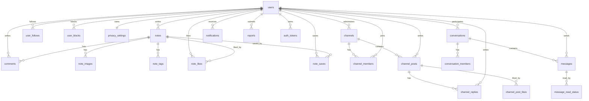

### 8.4 关键约束和索引

| 表 | 约束/索引 | 设计意图 |
| --- | --- | --- |
| `users.email` | UNIQUE | 保证校内邮箱账号唯一 |
| `users.role/status` | CHECK | 限定用户角色和账号状态枚举 |
| `user_follows` | 复合主键 + 非自关注 CHECK | 防止重复关注和自己关注自己 |
| `user_blocks` | 复合主键 + 非自拉黑 CHECK | 防止重复拉黑和自己拉黑自己 |
| `notes` | `idx_note_author_created`, `idx_note_visibility_created` | 支持作者页和公开流排序 |
| `comments` | `idx_comment_note_created` | 支持笔记评论按时间读取 |
| `channels` | `idx_channel_name`, `idx_channel_admin` | 支持频道搜索和管理员查询 |
| `channel_posts` | `idx_channel_post_order` | 支持频道内置顶优先和时间排序 |
| `notifications` | `idx_notification_user_read_created` | 支持未读通知查询 |
| `reports` | `idx_report_status_created`, `idx_report_target` | 支持举报处理和目标追踪 |
| `auth_tokens` | `idx_auth_token_user`, `idx_auth_token_expires` | 支持登录状态和过期清理 |

## 9. UI 界面设计

### 9.1 总体界面布局

系统采用左侧导航栏 + 顶部信息栏 + 主内容区域的布局。

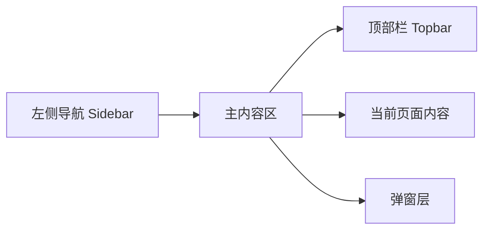

主要界面元素：

- 左侧导航：主页、社交圈、频道、聊天、收藏、个人资料、设置、全站管理。
- 顶部栏：页面标题、说明、通知入口。
- 主内容区：根据 `activeNav` 切换不同页面。
- 弹窗：发布笔记、笔记详情、评论、举报、频道加入、频道发帖、个人资料编辑等。

### 9.2 页面设计

| 页面 | 组件 | 核心内容 |
| --- | --- | --- |
| 登录/注册 | `AuthPage` | 登录、注册、找回密码、验证码 |
| 主页 | `HomePage` + `NotesFeed` | 公共笔记流、搜索、标签筛选、发布入口 |
| 社交圈 | `SocialCirclePage` | 好友/关注关系、社交笔记流、关注/拉黑/私信入口 |
| 频道 | `ChannelsPage` | 频道列表、频道详情、帖子列表、发帖、回复、公告、置顶 |
| 聊天 | `ChatsPage` + App 内聊天布局 | 会话列表、消息窗口、发送消息、标记已读 |
| 收藏 | `SavedPage` | 已收藏笔记列表和搜索 |
| 个人资料 | `ProfilePage` | 个人信息、资料编辑、用户内容入口 |
| 设置 | `SettingsPage` | 隐私设置、黑名单、主题切换 |
| 全站管理 | `AdminPage` | 统计面板、用户管理、频道管理、内容治理 |

### 9.3 交互设计

| 交互 | 设计 |
| --- | --- |
| 登录态保持 | 前端将 token 保存为 `localStorage["whu-token"]`，刷新后调用 `/auth/me` 恢复登录态 |
| 接口错误 | `api/client.js` 将非 0 code 转换为 `ApiError`，页面按场景展示错误提示 |
| 通知 | 顶部栏展示通知入口，支持单条已读和全部已读 |
| 频道操作 | 未加入时可预览部分帖子；加入后可发帖、回复、点赞 |
| 管理入口 | 只有 `currentUser.role === "ADMIN"` 时侧边栏显示“全站管理” |
| 图片上传 | 发布笔记时先上传图片，再把返回 URL 写入笔记 |
| 数据兜底 | 前端仍保留部分 mock 数据作为接口失败时的展示兜底 |

### 9.4 视觉风格

当前界面风格偏校园社交产品：

- 使用卡片、列表、弹窗和轻量按钮组织信息。
- 导航清晰，主要功能固定在侧边栏。
- 图标使用 `@phosphor-icons/react`。
- 主题色通过 `themeOptions` 和 CSS theme class 控制。
- 管理界面和普通用户界面保持一致视觉体系，但突出统计和治理操作。

## 10. 安全设计

### 10.1 认证与鉴权

- 使用 Bearer Token 作为 API 访问凭证。
- Token 存储在 `auth_tokens` 表中。
- `AuthenticationInterceptor` 拦截受保护接口。
- 被封禁用户即使持有 token，也会被拦截器拒绝访问。
- 全站管理员接口在 `AdminService` 中二次校验 `role = ADMIN`。

### 10.2 密码与验证码

- 用户密码使用 BCrypt 哈希保存。
- 验证码使用 `code_hash` 保存，不直接保存明文。
- 注册和找回密码区分不同 scene。
- 注册前校验邮箱域名，当前限制为 `whu.edu.cn`。

### 10.3 内容访问控制

- 笔记支持 `PUBLIC`、`FRIENDS`、`PRIVATE` 三种可见性。
- 拉黑关系会阻断评论和内容查看。
- 频道发帖、回复、点赞需要频道成员身份。
- 频道公告修改和帖子置顶需要频道管理员身份。

### 10.4 文件安全

- 图片仅允许 `image/jpeg`、`image/png`、`image/gif`、`image/webp`。
- 单张图片限制 5MB。
- 使用 UUID 文件名。
- 保存前进行路径归一化和目录边界校验。

## 11. 运行与配置设计

### 11.1 后端 Profile

| Profile | 作用 |
| --- | --- |
| `mock` | 默认内存数据模式，便于快速预览和测试 |
| `mysql` | MySQL 持久化模式，用于真实联调 |
| `smtp` | 真实邮箱验证码发送，可与 `mock` 或 `mysql` 组合 |

### 11.2 MySQL 配置

后端通过环境变量读取数据库连接：

```text
DB_URL
DB_USERNAME
DB_PASSWORD
```

当前共享数据库联调示例：

```powershell
$env:DB_URL="jdbc:mysql://100.97.230.36:3306/whu_circle?useUnicode=true&characterEncoding=utf8&serverTimezone=Asia/Shanghai"
$env:DB_USERNAME="whu_team"
$env:DB_PASSWORD="由组长单独提供"
mvn spring-boot:run "-Dspring-boot.run.profiles=mysql"
```

### 11.3 前端代理

Vite 开发服务器代理配置：

| 路径 | 代理目标 |
| --- | --- |
| `/api` | `http://127.0.0.1:8080` |
| `/uploads` | `http://127.0.0.1:8080` |

因此开发环境下前端请求 `/api/v1/...` 和 `/uploads/...` 时，会自动转发给本机后端。

## 12. 测试与质量设计

当前后端包含自动化测试：

- `ApiIntegrationTest`
- `SmtpProfileContextTest`

当前测试重点覆盖：

- 登录注册。
- 鉴权。
- 笔记可见性。
- 社交圈。
- 频道预览限制。
- 频道密码错误。
- SMTP profile 上下文加载。

建议后续补充：

- 管理员接口权限测试。
- 真实 MySQL profile 集成测试。
- 图片上传边界测试。
- 前端关键流程端到端测试。

## 13. 后续扩展设计

### 13.1 频道管理员体系

后续可以在现有 `channel_members.role` 基础上扩展：

- `OWNER`：初始管理员，一个频道只能有一个。
- `ADMIN`：被任命的频道管理员，可有多个。
- `MEMBER`：普通成员。

对应需要增加：

- 频道管理员申请接口。
- 初始管理员任命/移除管理员接口。
- 频道管理页面。
- 频道级权限判断服务。

### 13.2 图片存储升级

当前本地存储适合单机开发。后续真实部署可切换为：

- 对象存储，如 S3、OSS、COS、MinIO。
- 数据库存储图片元数据，不直接把大图片放入 MySQL。
- CDN 或静态资源服务器分发图片。

### 13.3 推荐系统升级

当前推荐反馈已经有 `recommendation_feedback` 表。后续可以基于：

- 用户关注关系。
- 标签偏好。
- 点赞、收藏、评论行为。
- 频道活跃度。

逐步实现更精细的推荐排序。

## 14. 设计依据文件

本文档根据当前项目代码和文档编写，主要依据如下：

| 内容 | 文件 |
| --- | --- |
| 前端主流程 | `src/App.jsx` |
| 前端 API 封装 | `src/api/*.js` |
| 前端页面组件 | `src/pages/*.jsx` |
| 后端控制器 | `backend/src/main/java/com/whucircle/controller/*.java` |
| 后端业务服务 | `backend/src/main/java/com/whucircle/service/*.java` |
| 后端领域对象 | `backend/src/main/java/com/whucircle/domain/*.java` |
| 后端 DTO | `backend/src/main/java/com/whucircle/dto/*.java` |
| 后端 Repository | `backend/src/main/java/com/whucircle/repository/*.java` |
| MySQL 表结构 | `backend/sql/001_schema.sql` |
| 管理员迁移 | `backend/sql/003_admin_migration.sql` |
| 后端配置 | `backend/src/main/resources/application*.yml` |
| 前端代理 | `vite.config.mjs` |
