# WHU Circle 系统设计说明书

## 1. 系统体系架构

### 1.1 总体架构

系统采用前后端分离的四层结构：浏览器 → React + Vite 前端 → Spring Boot 后端 → MySQL（业务数据）+ MinIO（图片文件）。开发环境下图片可存储在后端本地目录 `uploads/images`；团队联调时通过 MinIO 对象存储实现跨机器图片共享。

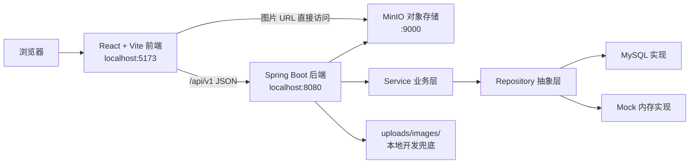

### 1.2 前端架构

单页应用，`App.jsx` 集中管理登录态、页面导航、业务数据和弹窗状态。`src/api/` 封装后端接口，`api/client.js` 统一处理 Bearer Token、JSON 响应和错误转换。

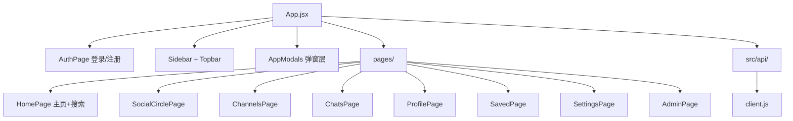

### 1.3 后端架构

Controller → Service → Repository 三层分层，通过 `AuthenticationInterceptor` 拦截认证，统一返回 `ApiResponse(code, message, data)`。

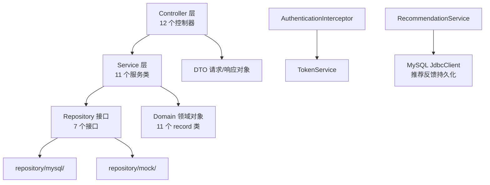

控制器共 12 个：Auth、Note、User、Channel、Chat、Notification、Settings、Report、Recommendation、File、Admin、Health。业务逻辑全部集中在 11 个 Service 类中，Repository 接口支持 MySQL 和内存 Mock 两套实现。

### 1.4 部署架构

团队通过 Tailscale 私有网络共享组长电脑上的 MySQL（业务数据）和 MinIO（图片文件），每位成员本机运行前后端。

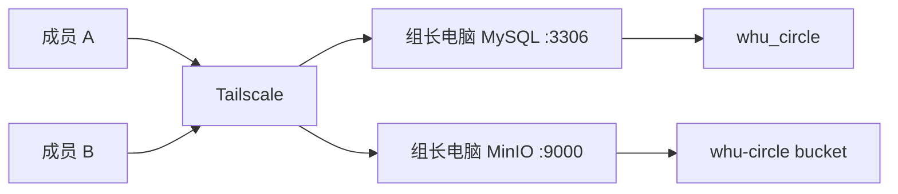

## 2. 系统功能结构

### 2.1 功能层次

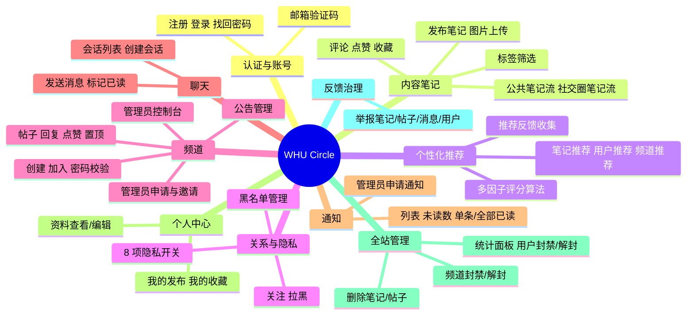

### 2.2 角色权限

| 角色 | 说明 |
| --- | --- |
| 游客 | 仅可访问登录、注册、找回密码页面 |
| 普通用户 | 笔记、社交、频道、聊天、通知、设置、推荐等全功能 |
| 频道管理员 | 修改公告、置顶帖子、受邀成为管理员；初始管理员可邀请/审批管理员 |
| 全站管理员（`role=ADMIN`） | 管理面板、封禁用户/频道、删除任意内容 |

## 3. 系统用例时序图

### 3.1 登录

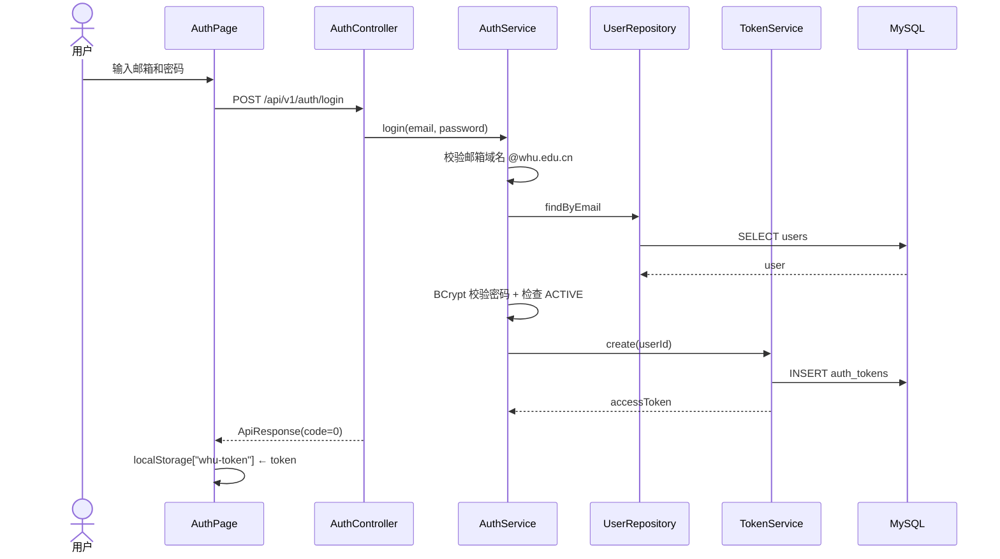

### 3.2 发布笔记（含图片上传）

```mermaid
sequenceDiagram
    actor U as 用户
    participant FE as 发布弹窗
    participant File as FileController
    participant Note as NoteController
    participant S as NoteService
    participant R as NoteRepository
    participant FS as 本地/MinIO 存储
    participant DB as MySQL

    U->>FE: 选图 + 填写标题正文
    FE->>File: POST /api/v1/files/images (multipart)
    File->>File: 校验类型(仅 jpg/png/gif/webp) + 限 5MB
    File->>FS: 本地目录或 MinIO 保存
    File-->>FE: { imageUrl }
    FE->>Note: POST /api/v1/notes
    Note->>S: create(userId, request)
    S->>R: save(note)
    R->>DB: INSERT notes, note_images, note_tags
    R-->>S: note
    Note-->>FE: NoteView
    FE->>FE: 刷新笔记流
```

### 3.3 频道管理员申请与审批

```mermaid
sequenceDiagram
    actor M as 普通成员
    actor A as 初始管理员
    participant FE as ChannelsPage
    participant API as ChannelController
    participant S as ChannelService
    participant R as ChannelRepository
    participant N as NotificationRepository
    participant DB as MySQL

    M->>FE: 在频道中点击"申请成为管理员"
    FE->>API: POST /channels/{id}/admin-applications
    API->>S: applyForAdmin(userId, channelId)
    S->>S: requireMember + 检查非管理员
    S->>R: saveAdminRequest(type=APPLY, status=PENDING)
    R->>DB: INSERT channel_admin_requests
    S->>N: 创建通知给初始管理员
    API-->>FE: AdminRequestView

    A->>FE: 进入初始管理员控制台
    FE->>API: GET /channels/{id}/initial-admin
    S->>S: requireInitialAdministrator
    S->>R: findAdminRequests
    API-->>FE: InitialAdminDashboard(含待审批列表)
    A->>FE: 点击批准
    FE->>API: PUT /channel-admin-requests/{id} {action:"APPROVE"}
    S->>S: requireInitialAdministrator
    S->>R: saveAdminRequest(status=APPROVED)
    S->>R: setMemberRole→"ADMIN"
    S->>N: 通知申请者结果
    API-->>FE: 更新后的 AdminRequestView
```

该流程同样支持邀请（INVITE）方向：初始管理员邀请成员，成员自行接受或拒绝。

### 3.4 社交圈笔记流

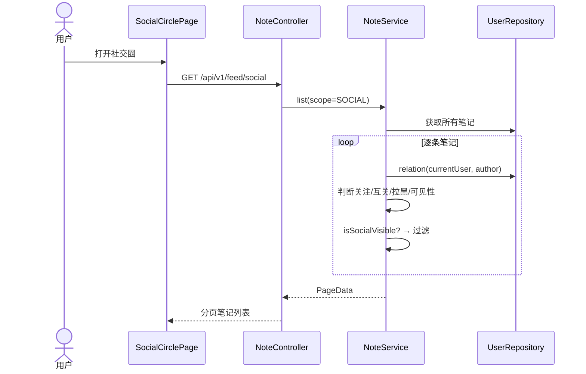

社交圈过滤规则：双方不能存在拉黑关系；PUBLIC 笔记仅展示关注者或好友的，FRIENDS 仅互关好友可见。

### 3.5 全站管理员治理

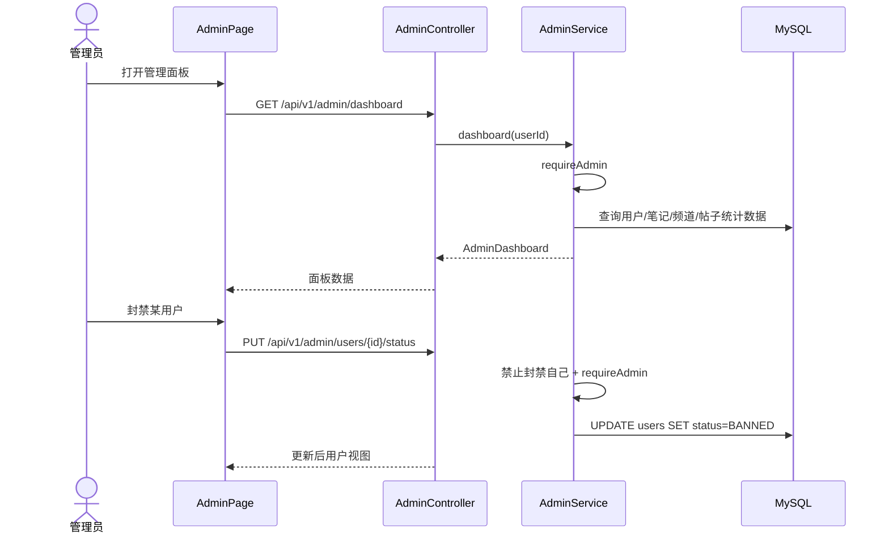

## 4. 复杂功能算法设计

### 4.1 笔记可见性判断

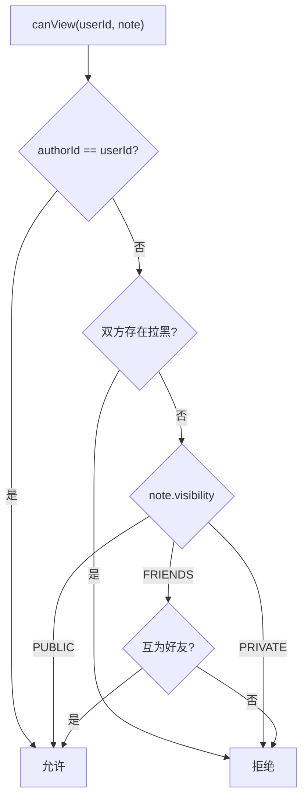

```
function canView(userId, note):
    if note.authorId == userId: return true
    if isBlockedEitherWay(userId, note.authorId): return false
    if note.visibility == PUBLIC: return true
    if note.visibility == FRIENDS:
        return relation(userId, note.authorId) == FRIEND
    return false
```

### 4.2 个性化推荐评分算法

推荐系统为笔记、用户、频道三类目标分别计算推荐分，综合排序后展示。

**笔记推荐评分**（100 分制，多因子加权）：

```
function scoreNote(currentUser, note):
    score = 35                                    // 基础分
    if author.college == currentUser.college:     // 同学院 +18
        score += 18
    if author.grade == currentUser.grade:         // 同年级 +8
        score += 8
    if relation == FRIEND: score += 22            // 好友圈层
    if relation == FOLLOWING: score += 15         // 已关注
    tagOverlap = countIntersection(note.tags, interestTags)
    score += tagOverlap * 8                        // 标签偏好
    score += min(likeCount*0.7 + commentCount*0.9, 18)  // 互动热度
    return clamp(score)
```

**用户推荐评分**（基于同学院/同年级/粉丝互动）：

```
function scoreUser(currentUser, user):
    score = 30
    if sameCollege: score += 20
    if sameGrade: score += 12
    if relation == FOLLOWER: score += 14           // 对方已关注你
    score += min(followers*0.4 + following*0.2, 10)
    return clamp(score)
```

**频道推荐评分**（基于公开性/成员数/关系网络）：

```
function scoreChannel(currentUser, channel):
    score = 28 + min(memberCount * 0.25, 18)       // 成员规模
    if joinType == PUBLIC: score += 10
    relatedCount = countFriendsInChannel(currentUser, channel)
    score += relatedCount * 14                      // 社交关系密度
    return clamp(score)
```

推荐结果按评分降序排列，首页混合三类内容各取 4 条。评分受隐私设置控制：关闭个性化推荐时不使用同学院/同年级/标签偏好维度；关闭可被搜索的用户不出现在推荐中。

**推荐反馈流程**：

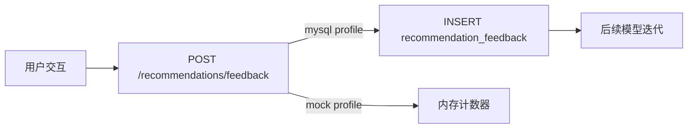

### 4.3 频道管理员审批流程

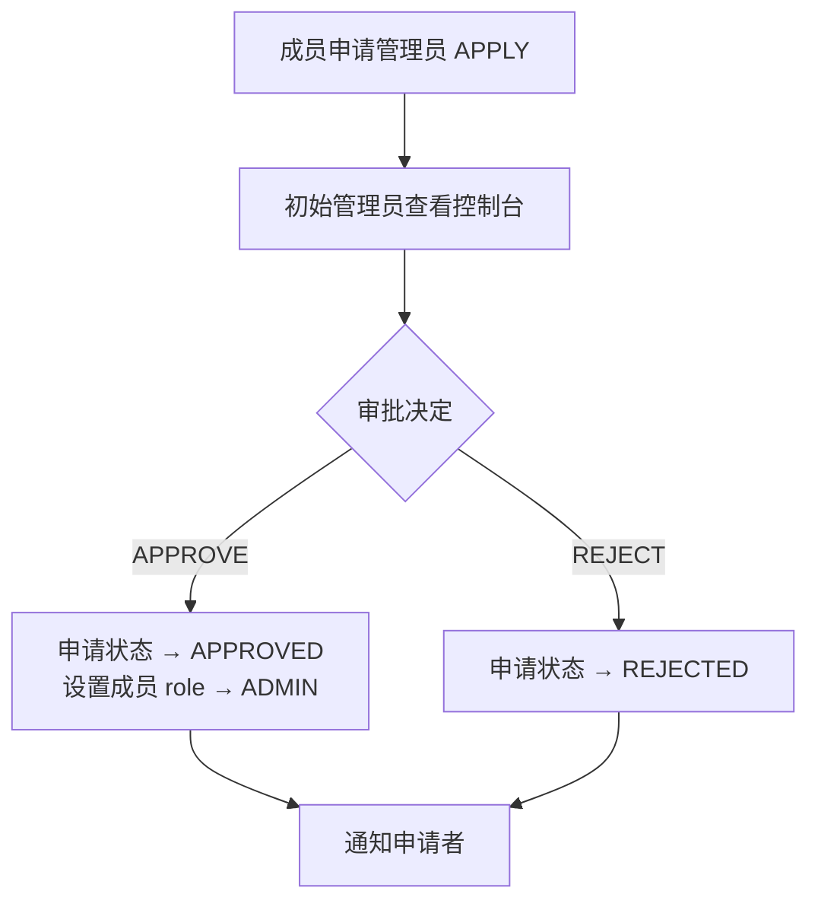

邀请流程（INVITE）由初始管理员发起，被邀请者选择 ACCEPT 或 DECLINE。

### 4.4 关系状态计算

```
function relation(currentUserId, targetUserId):
    if isBlockedEitherWay(currentUserId, targetUserId): return BLOCKED
    iFollow = follows.exists(currentUserId, targetUserId)
    followsMe = follows.exists(targetUserId, currentUserId)
    if iFollow and followsMe: return FRIEND
    if iFollow: return FOLLOWING
    if followsMe: return FOLLOWER
    return NONE
```

### 4.5 通知生成策略

| 触发事件 | 通知接收者 | 通知类型 |
| --- | --- | --- |
| 被关注 | 被关注者 | FOLLOW |
| 笔记被评论 | 笔记作者 | COMMENT |
| 笔记被点赞 | 笔记作者 | LIKE |
| 频道帖子被回复 | 帖子作者 | POST_REPLY |
| 管理员申请 | 频道初始管理员 | CHANNEL_ADMIN_APPLICATION |
| 管理员邀请 | 被邀请者 | CHANNEL_ADMIN_INVITE |
| 申请/邀请结果 | 申请者/邀请者 | CHANNEL_ADMIN_RESULT |

存在拉黑关系时跳过通知创建。

## 5. 面向对象类图设计

### 5.1 领域模型类图

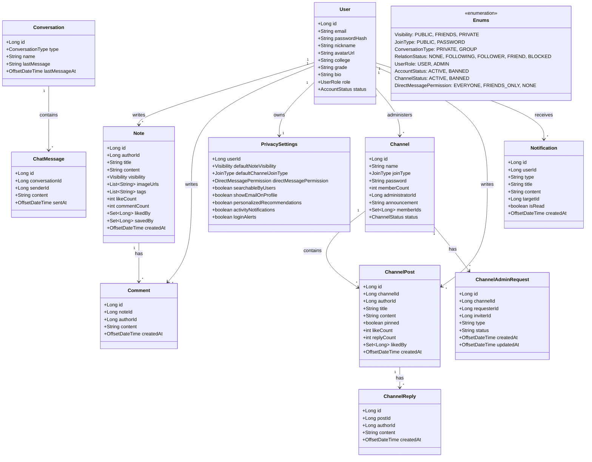

所有领域对象均为 Java `record`（不可变），通过 Repository 接口完成持久化。

### 5.2 后端分层类图

```mermaid
classDiagram
    class AuthController {
        +login() +register() +sendCode()
        +resetPassword() +me() +logout()
    }

    class NoteController {
        +list() +create() +detail() +comments()
        +comment() +like() +save()
        +socialFeed() +tags()
        +deleteNote() +deleteComment()
    }

    class UserController {
        +currentProfile() +updateCurrentProfile()
        +profile() +search() +relations()
        +follow() +unfollow()
        +block() +unblock() +blocks()
    }

    class ChannelController {
        +channels() +detail() +managedChannels()
        +initialAdmin() +applyForAdmin() +inviteAdmin()
        +handleAdminRequest()
        +createChannel() +updateAnnouncement() +join()
        +posts() +createPost() +postDetail()
        +reply() +like() +pin()
    }

    class ChatController {
        +conversations() +createConversation()
        +messages() +send() +read()
    }

    class NotificationController {
        +list() +count() +markRead() +markAllRead()
    }

    class SettingsController {
        +get() +update()
    }

    class RecommendationController {
        +home() +notes() +users() +channels() +feedback()
    }

    class ReportController { +create() }
    class FileController { +uploadImage() }
    class AdminController {
        +dashboard() +setUserStatus()
        +setChannelStatus() +deleteNote() +deleteChannelPost()
    }

    class NoteService {
        +list() +create() +detail() +comment()
        +toggleLike() +toggleSave() +delete() +deleteComment()
        -canView() -isSocialVisible()
    }

    class ChannelService {
        +list() +detail() +create() +join()
        +managedChannels() +initialAdminDashboard()
        +applyForAdmin() +inviteAdmin() +handleAdminRequest()
        +posts() +createPost() +reply() +toggleLike() +setPinned()
    }

    class AdminService {
        +dashboard() +setUserStatus()
        +setChannelStatus() +deleteNote() +deleteChannelPost()
        -requireAdmin()
    }

    class RecommendationService {
        +home() +notes() +users() +channels() +feedback()
        -scoreNote() -scoreUser() -scoreChannel()
    }

    class UserService {
        +currentProfile() +profile() +search() +relations()
        +follow() +unfollow() +block() +unblock() +blockedUsers()
    }

    class NoteRepository { <<interface>> }
    class UserRepository { <<interface>> }
    class ChannelRepository { <<interface>> }
    class ChatRepository { <<interface>> }
    class NotificationRepository { <<interface>> }
    class SettingsRepository { <<interface>> }

    class AuthenticationInterceptor { +preHandle() }
    class TokenService { +create() +validate() }
    class ApiResponse~T~ { +int code +String message +T data }

    NoteController --> NoteService
    ChannelController --> ChannelService
    AdminController --> AdminService
    UserController --> UserService
    RecommendationController --> RecommendationService
    NoteService --> NoteRepository
    NoteService --> UserRepository
    ChannelService --> ChannelRepository
    ChannelService --> UserRepository
    ChannelService --> NotificationRepository
    AdminService --> UserRepository
    AdminService --> NoteRepository
    AdminService --> ChannelRepository
    RecommendationService --> UserRepository
    RecommendationService --> NoteRepository
    RecommendationService --> ChannelRepository
    RecommendationService --> SettingsRepository
    AuthenticationInterceptor --> TokenService
```

## 6. 接口设计

所有接口前缀 `/api/v1`，统一返回 `{ code: 0, message: "success", data: ... }`。认证通过 `Authorization: Bearer <token>`。

### 6.1 认证接口

| 方法 | 路径 | 说明 |
| --- | --- | --- |
| POST | `/auth/send-code` | 发送邮箱验证码 |
| POST | `/auth/register` | 注册 |
| POST | `/auth/login` | 登录 |
| POST | `/auth/reset-password` | 找回密码 |
| GET | `/auth/me` | 当前用户信息 |
| POST | `/auth/logout` | 退出登录 |

### 6.2 笔记接口

| 方法 | 路径 | 说明 |
| --- | --- | --- |
| GET | `/notes?scope&keyword&tag&page&size` | 笔记列表 |
| POST | `/notes` | 发布笔记 |
| GET | `/notes/{id}` | 笔记详情 |
| DELETE | `/notes/{id}` | 删除笔记 |
| GET | `/notes/{id}/comments` | 评论列表 |
| POST | `/notes/{id}/comments` | 发表评论 |
| DELETE | `/notes/{id}/comments/{commentId}` | 删除评论 |
| POST | `/notes/{id}/like` | 点赞/取消 |
| POST | `/notes/{id}/save` | 收藏/取消 |
| GET | `/feed/social` | 社交圈笔记流 |
| GET | `/tags` | 标签列表 |

### 6.3 用户与关系接口

| 方法 | 路径 | 说明 |
| --- | --- | --- |
| GET | `/users/me/profile` | 当前用户完整资料（含统计） |
| PUT | `/users/me/profile` | 编辑个人资料 |
| GET | `/users/{id}` | 查看他人主页 |
| GET | `/users/search?keyword` | 搜索用户 |
| GET | `/relations` | 全部用户关系列表 |
| POST | `/users/{id}/follow` | 关注 |
| DELETE | `/users/{id}/follow` | 取消关注 |
| POST | `/users/{id}/block` | 拉黑 |
| DELETE | `/users/{id}/block` | 取消拉黑 |
| GET | `/blocks` | 黑名单列表 |

### 6.4 频道接口

| 方法 | 路径 | 说明 |
| --- | --- | --- |
| GET | `/channels?joined&keyword&page&size` | 频道列表（支持筛选已加入） |
| POST | `/channels` | 创建频道 |
| GET | `/channels/{id}` | 频道详情 |
| POST | `/channels/{id}/join` | 加入频道 |
| PUT | `/channels/{id}/announcement` | 修改公告（管理员） |
| GET | `/channels/managed` | 我管理的频道 |
| GET | `/channels/{id}/initial-admin` | 初始管理员控制台 |
| POST | `/channels/{id}/admin-applications` | 申请成为管理员 |
| POST | `/channels/{id}/admin-invitations` | 邀请管理员（初始管理员） |
| PUT | `/channel-admin-requests/{id}` | 处理管理员申请/邀请 |
| GET | `/channels/{id}/posts` | 帖子列表 |
| POST | `/channels/{id}/posts` | 发布帖子 |
| GET | `/channel-posts/{id}` | 帖子详情（含回复） |
| POST | `/channel-posts/{id}/replies` | 回复帖子 |
| POST | `/channel-posts/{id}/like` | 点赞帖子 |
| PUT | `/channel-posts/{id}/pin` | 置顶帖子（管理员） |

### 6.5 聊天、通知、设置、推荐、举报、文件、管理接口

| 模块 | 方法 | 路径 | 说明 |
| --- | --- | --- | --- |
| 聊天 | GET | `/conversations` | 会话列表 |
| 聊天 | POST | `/conversations` | 创建会话 |
| 聊天 | GET | `/conversations/{id}/messages` | 消息列表 |
| 聊天 | POST | `/conversations/{id}/messages` | 发送消息 |
| 聊天 | PUT | `/conversations/{id}/read` | 标记已读 |
| 通知 | GET | `/notifications` | 通知列表 |
| 通知 | GET | `/notifications/count` | 未读数量 |
| 通知 | PUT | `/notifications/{id}/read` | 单条已读 |
| 通知 | PUT | `/notifications/read-all` | 全部已读 |
| 设置 | GET | `/settings/privacy` | 隐私设置（8 项） |
| 设置 | PUT | `/settings/privacy` | 修改隐私设置 |
| 推荐 | GET | `/recommendations/home` | 首页推荐（混合内容） |
| 推荐 | GET | `/recommendations/notes` | 笔记推荐 |
| 推荐 | GET | `/recommendations/users` | 用户推荐 |
| 推荐 | GET | `/recommendations/channels` | 频道推荐 |
| 推荐 | POST | `/recommendations/feedback` | 推荐反馈 |
| 举报 | POST | `/reports` | 提交举报 |
| 文件 | POST | `/files/images` | 上传图片（multipart/form-data） |
| 管理 | GET | `/admin/dashboard` | 管理面板 |
| 管理 | PUT | `/admin/users/{id}/status` | 封禁/解封用户 |
| 管理 | PUT | `/admin/channels/{id}/status` | 封禁/解封频道 |
| 管理 | DELETE | `/admin/notes/{id}` | 删除笔记 |
| 管理 | DELETE | `/admin/channel-posts/{id}` | 删除频道帖子 |

### 6.6 统一错误码

| 错误码 | 含义 |
| --- | --- |
| 0 | 成功 |
| 40000 | 请求参数错误 |
| 40001 | 邮箱或密码错误 |
| 40002 | 验证码错误或过期 |
| 40100 | 未登录或 Token 过期 |
| 40300 | 没有访问权限 |
| 40301 | 不是好友，无法查看好友可见内容 |
| 40302 | 未加入频道 |
| 40303 | 频道密码错误 |
| 40400 | 数据不存在 |
| 40900 | 状态冲突 |
| 50000 | 服务器内部错误 |

## 7. 数据库物理设计

### 7.1 基本配置

| 项目 | 设计 |
| --- | --- |
| 数据库名 | `whu_circle` |
| 字符集 | `utf8mb4`，排序规则 `utf8mb4_0900_ai_ci` |
| 引擎 | InnoDB |
| 主键策略 | BIGINT AUTO_INCREMENT 或复合主键 |
| 时间精度 | `DATETIME(3)` |

### 7.2 数据表清单

| 表名 | 作用 | 关键字段 |
| --- | --- | --- |
| `users` | 用户账号与资料 | `email`(UNIQUE), `password_hash`, `role`, `status` |
| `email_verification_codes` | 邮箱验证码 | `email`, `scene`, `code_hash`, `expires_at` |
| `user_follows` | 关注关系 | 复合主键 `(follower_id, followed_id)`, CHECK 非自关注 |
| `user_blocks` | 拉黑关系 | 复合主键 `(blocker_id, blocked_id)`, CHECK 非自拉黑 |
| `privacy_settings` | 隐私设置（8 项） | `user_id` 主键，含 `searchable_by_users` 等 5 个新增布尔开关 |
| `notes` | 笔记 | `author_id`, `visibility`, `like_count`, `comment_count` |
| `note_images` | 笔记图片 | `note_id`, `image_url`, `sort_order` |
| `note_tags` | 笔记标签 | 复合主键 `(note_id, tag)` |
| `comments` | 笔记评论 | `note_id`, `author_id`, `content` |
| `note_likes` | 笔记点赞 | 复合主键 `(note_id, user_id)` |
| `note_saves` | 笔记收藏 | 复合主键 `(note_id, user_id)` |
| `channels` | 频道 | `name`, `join_type`, `administrator_id`, `status` |
| `channel_members` | 频道成员 | 复合主键 `(channel_id, user_id)`, `role`（MEMBER/ADMIN） |
| `channel_admin_requests` | 管理员申请/邀请 | `channel_id`, `requester_id`, `inviter_id`, `type`, `status` |
| `channel_posts` | 频道帖子 | `channel_id`, `author_id`, `pinned` |
| `channel_replies` | 频道回复 | `post_id`, `author_id` |
| `channel_post_likes` | 帖子点赞 | 复合主键 `(post_id, user_id)` |
| `conversations` | 聊天会话 | `type`, `last_message`, `last_message_at` |
| `conversation_members` | 会话成员 | 复合主键 `(conversation_id, user_id)` |
| `messages` | 聊天消息 | `conversation_id`, `sender_id`, `content` |
| `message_read_status` | 已读状态 | 复合主键 `(message_id, user_id)` |
| `notifications` | 通知 | `user_id`, `type`, `is_read` |
| `reports` | 举报记录 | `reporter_id`, `target_type`, `target_id`, `status` |
| `auth_tokens` | 登录凭证 | `token`(PK), `user_id`, `expires_at` |
| `recommendation_feedback` | 推荐反馈 | `user_id`, `scene`, `target_type`, `action` |

### 7.3 ER 图

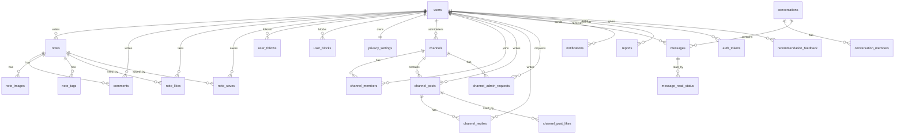

### 7.4 关键索引策略

| 表 | 索引 | 目的 |
| --- | --- | --- |
| `notes` | `idx_note_author_created (author_id, created_at)` | 按作者时间排序 |
| `notes` | `idx_note_visibility_created (visibility, created_at)` | 公开笔记流排序 |
| `comments` | `idx_comment_note_created (note_id, created_at)` | 笔记评论时间序 |
| `channel_admin_requests` | `idx_car_channel_status (channel_id, status, created_at)` | 频道内待审批查询 |
| `channel_admin_requests` | `idx_car_requester_status (requester_id, status, created_at)` | 用户申请状态查询 |
| `channel_posts` | `idx_channel_post_order (channel_id, pinned, created_at)` | 置顶优先+时间序 |
| `notifications` | `idx_notification_user_read_created (user_id, is_read, created_at)` | 未读通知查询 |
| `reports` | `idx_report_status_created (status, created_at)` | 举报处理队列 |
| `auth_tokens` | `idx_auth_token_user / idx_auth_token_expires` | 登录态查询和过期清理 |

## 8. UI 界面设计

### 8.1 整体布局

左侧固定导航栏 + 顶部标题栏（含通知入口）+ 中间主内容区 + 全局弹窗层。

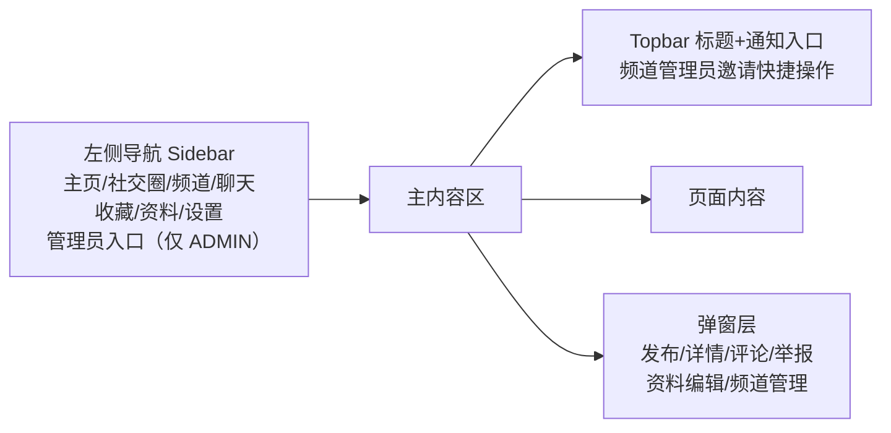

### 8.2 页面清单

| 页面 | 组件 | 核心功能 |
| --- | --- | --- |
| 登录/注册 | `AuthPage` | 登录、注册、找回密码、验证码 |
| 主页 | `HomePage` + `NotesFeed` | 公共笔记流、搜索笔记/用户、标签筛选、排序、推荐卡片 |
| 社交圈 | `SocialCirclePage` | 关注者笔记流、关注/拉黑/私信入口 |
| 频道 | `ChannelsPage` | 频道列表、详情、发帖、回复、公告编辑、管理员控制台、申请管理员 |
| 聊天 | `ChatsPage` | 会话列表、消息窗口、发送、已读标记 |
| 收藏 | `SavedPage` | 已收藏笔记列表 |
| 个人资料 | `ProfilePage` | 个人信息展示与编辑 |
| 设置 | `SettingsPage` | 8 项隐私设置（可见范围、搜索、推荐、通知）、黑名单、主题切换 |
| 全站管理 | `AdminPage` | 统计指标面板、用户封禁/解封、频道封禁/解封、删除违规笔记/帖子 |

### 8.3 关键交互设计

| 交互 | 实现方式 |
| --- | --- |
| 登录态保持 | `localStorage["whu-token"]`，刷新后调用 `/auth/me` 恢复 |
| 接口错误处理 | `client.js` 统一将非 0 code 转为 `ApiError`，页面按场景展示 |
| 通知提醒 | Topbar 通知面板，频道管理员邀请可直接"接受/拒绝" |
| 频道访问控制 | 未加入可预览 5 条帖子，加入后可发帖、回复、点赞 |
| 管理入口显隐 | `currentUser.role === "ADMIN"` 时侧栏和菜单显示"全站管理" |
| 图片上传流程 | 先 POST `/files/images` 拿 URL，再将 URL 随笔记提交 |
| 用户搜索 | 主页搜索栏支持笔记/用户模式切换，搜索结果展示昵称、学院、年级、邮箱 |

### 8.4 视觉风格

- 卡片、列表、弹窗、轻量按钮组合布局
- 图标库：`@phosphor-icons/react`
- 主题色通过 CSS class 切换
- 管理界面与普通界面保持统一视觉体系，通过指标面板突出统计数据

---

## 9. 技术栈全景

以下为系统各层所采用的核心技术与组件。

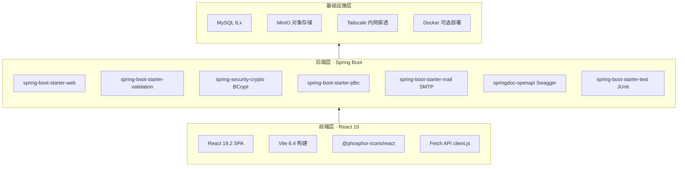

| 层次 | 技术 | 版本/说明 |
| --- | --- | --- |
| 前端框架 | React | 19.2.0，函数组件 + Hooks |
| 构建工具 | Vite | 6.4.2，HMR 热更新 |
| 图标 | @phosphor-icons/react | 2.1.10 |
| 后端框架 | Spring Boot | 嵌入式 Tomcat |
| 安全 | BCrypt + Bearer Token | 密码哈希，无状态认证 |
| 数据库 | MySQL | 8.x，InnoDB，utf8mb4 |
| 对象存储 | MinIO | S3 兼容，bucket: whu-circle |
| 内网穿透 | Tailscale | 私有网络，100.x.y.z |
| 容器化 | Docker | docker-compose.yml |
| API 文档 | Swagger / OpenAPI | springdoc-openapi |
| 测试 | JUnit | ApiIntegrationTest 等 |
| 构建 | Maven + npm | 前后端独立构建 |

---

## 附录：安全设计要点

| 层次 | 措施 |
| --- | --- |
| 认证 | Bearer Token，`AuthenticationInterceptor` 拦截校验 |
| 密码 | BCrypt 哈希，不存明文 |
| 验证码 | `code_hash` 存储，区分 scene，限制尝试次数 |
| 注册 | 校验 `@whu.edu.cn` 邮箱域名 |
| 内容可见性 | PUBLIC / FRIENDS / PRIVATE 三级，拉黑关系阻断访问 |
| 管理权限 | Controller 层拦截 + Service 层 `requireAdmin` 双重校验 |
| 频道管理员 | 区分初始管理员（OWNER）与普通管理员（ADMIN），初始管理员唯一拥有邀请和审批权限 |
| 隐私控制 | 8 项布尔开关覆盖搜索可见、邮箱展示、个性化推荐、活动通知、登录提醒 |
| 文件安全 | 仅允许 jpg/png/gif/webp，限 5MB，UUID 文件名，路径归一化；团队联调通过 MinIO 对象存储共享图片，密钥不提交 Git |
| 封禁用户 | 即使持有有效 token 也被拦截器拒绝 |
