# WHU Circle 系统设计说明书

## 1. 系统体系架构

### 1.1 总体架构

系统采用前后端分离的四层结构：浏览器 → React + Vite 前端 → Spring Boot 后端 → MySQL 数据库。图片文件存储在后端本地目录 `uploads/images`。

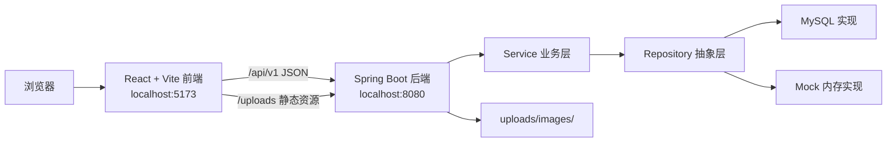

### 1.2 前端架构

单页应用，`App.jsx` 集中管理登录态、页面导航和弹窗状态。`src/api/` 封装后端接口，`api/client.js` 统一处理 Bearer Token、JSON 响应和错误转换。

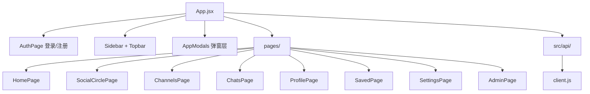

### 1.3 后端架构

Controller → Service → Repository 三层架构，通过 `AuthenticationInterceptor` 拦截认证，统一返回 `ApiResponse(code, message, data)`。

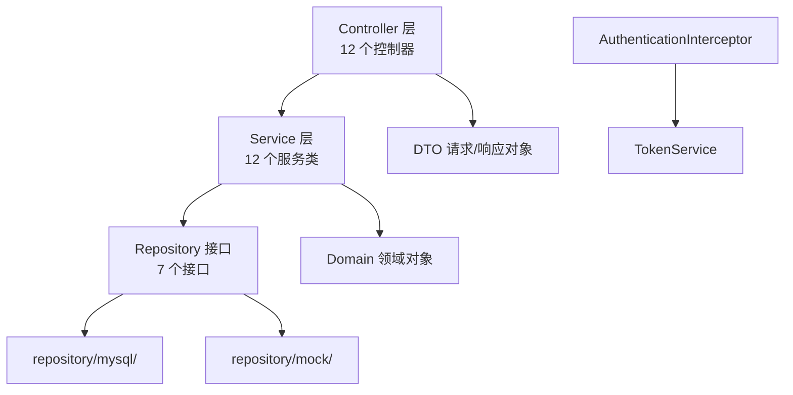

Controller：接收请求，读取 `@CurrentUser`，返回 `ApiResponse`。Service：实现业务逻辑（可见性、权限校验、关系判断）。Repository：定义数据访问接口，支持 MySQL 持久化和内存 Mock 两套实现。

### 1.4 部署架构

团队通过 Tailscale 私有网络共享组长电脑上的 MySQL 数据库，每位成员本机运行前后端。

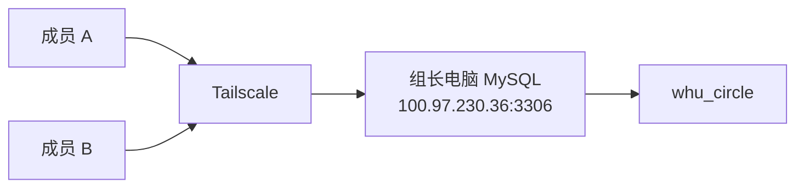

## 2. 系统功能结构

### 2.1 功能层次

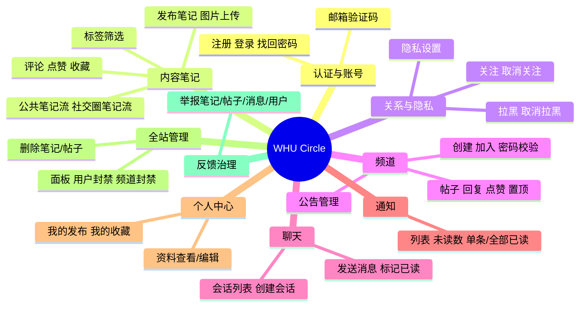

### 2.2 角色权限

| 角色 | 说明 |
| --- | --- |
| 游客 | 仅可访问登录、注册、找回密码页面 |
| 普通用户 | 笔记、社交、频道、聊天、通知、设置等全功能 |
| 频道管理员 | 修改频道公告、置顶帖子 |
| 全站管理员（`role=ADMIN`） | 管理面板、封禁用户/频道、删除任意内容 |

## 3. 系统用例时序图

### 3.1 登录

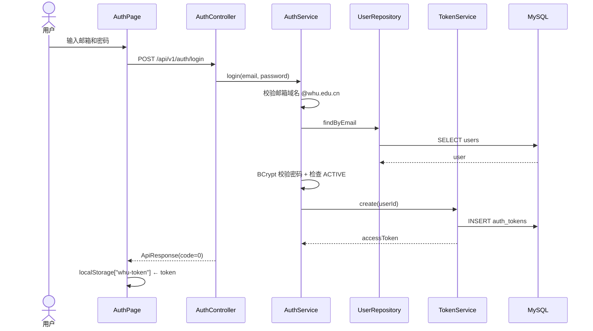

登录校验顺序：邮箱域名 → 用户存在 → 密码正确 → 账号未封禁 → 生成 token。

### 3.2 发布笔记（含图片上传）

```mermaid
sequenceDiagram
    actor U as 用户
    participant FE as 发布弹窗
    participant File as FileController
    participant Note as NoteController
    participant S as NoteService
    participant R as NoteRepository
    participant FS as uploads/images
    participant DB as MySQL

    U->>FE: 选图 + 填写标题正文
    FE->>File: POST /api/v1/files/images (multipart)
    File->>File: 校验类型+jpg/png/gif/webp 限 5MB
    File->>FS: 保存为 UUID 文件名
    File-->>FE: { imageUrl }
    FE->>Note: POST /api/v1/notes
    Note->>S: create(userId, request)
    S->>R: save(note)
    R->>DB: INSERT notes, note_images, note_tags
    R-->>S: note
    Note-->>FE: NoteView
    FE->>FE: 刷新笔记流
```

图片上传与笔记创建分两步：先上传拿 URL，再将 URL 列表随笔记提交。

### 3.3 社交圈笔记流

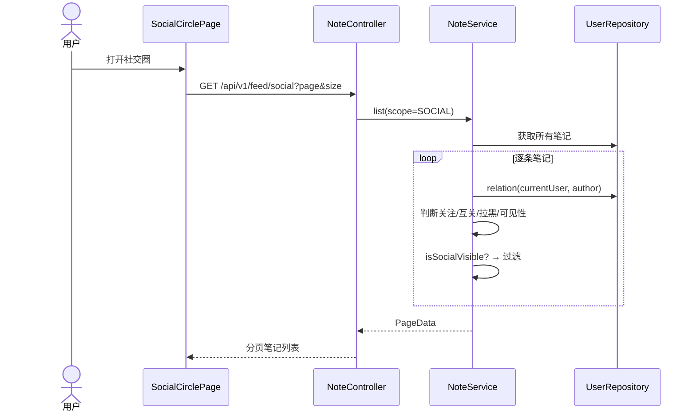

社交圈过滤规则：双方不能存在拉黑关系；PUBLIC 笔记直接可见，FRIENDS 笔记仅互关好友可见，PRIVATE 不可见。

### 3.4 全站管理员治理

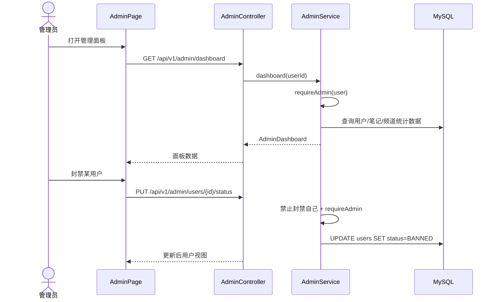

后端每个管理接口均二次执行 `requireAdmin`，防止绕过前端直接调用。

## 4. 复杂功能算法设计

### 4.1 笔记可见性判断

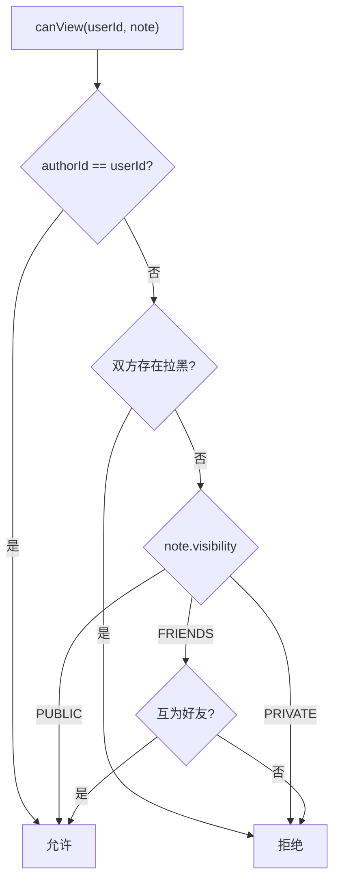

```
function canView(userId, note):
    if note.authorId == userId: return true
    if isBlockedEitherWay(userId, note.authorId): return false
    if note.visibility == PUBLIC: return true
    if note.visibility == FRIENDS:
        return relation(userId, note.authorId) == FRIEND
    return false
```

### 4.2 社交圈可见性判断

社交圈笔记流在 `canView` 基础上增加了关注关系和范围限定：

```
function isSocialVisible(userId, note):
    if note.authorId == userId: return false          // 不看自己
    if canView(userId, note) == false: return false   // 基础可见性
    if note.visibility == FRIENDS: return true         // 好友可见即通过
    if note.visibility == PUBLIC:
        // 公开笔记只展示关注的人或互关好友
        rel = relation(userId, note.authorId)
        return rel == FOLLOWING or rel == FRIEND
    return false
```

### 4.3 频道加入与密码校验

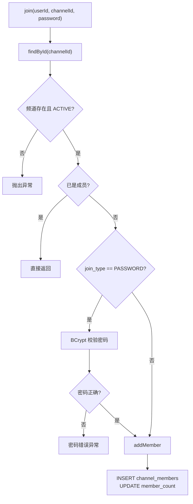

### 4.4 关系状态计算

```
function relation(currentUserId, targetUserId):
    if isBlockedEitherWay(currentUserId, targetUserId): return BLOCKED
    iFollow = follows.exists(currentUserId, targetUserId)
    followsMe = follows.exists(targetUserId, currentUserId)
    if iFollow and followsMe: return FRIEND
    if iFollow: return FOLLOWING
    if followsMe: return FOLLOWER
    return NONE
```

### 4.5 通知生成策略

| 触发事件 | 通知接收者 | 通知类型 |
| --- | --- | --- |
| 被关注 | 被关注者 | FOLLOW |
| 笔记被评论 | 笔记作者 | COMMENT |
| 笔记被点赞 | 笔记作者 | LIKE |
| 评论被回复（预留） | 评论作者 | REPLY |
| 频道帖子被回复 | 帖子作者 | CHANNEL_REPLY |

生成通知时，如果触发者与接收者之间存在拉黑关系，则跳过通知创建。

## 5. 面向对象类图设计

### 5.1 领域模型类图

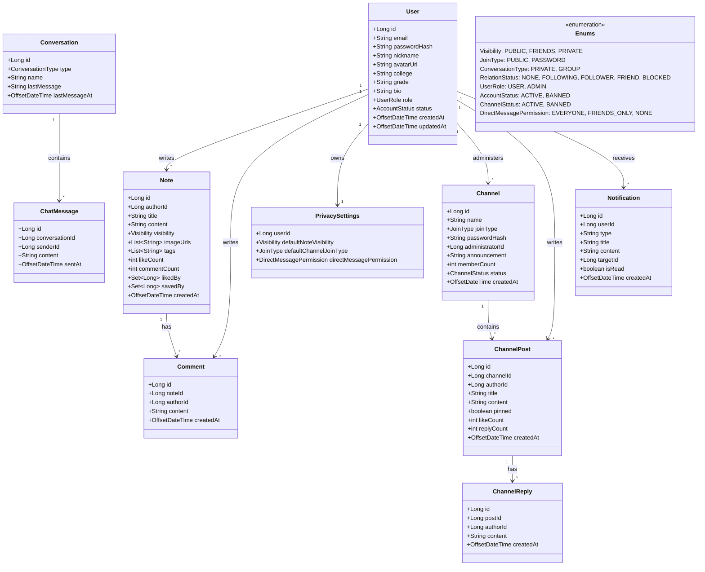

领域对象均为不可变记录类（Java `record`），通过 Repository 接口完成持久化。

### 5.2 后端分层类图

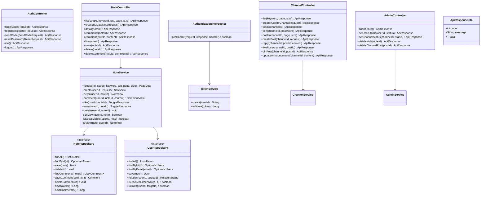

Controller 层只做参数接收和响应封装；Service 层包含全部业务逻辑；Repository 接口分离数据访问，通过 Spring Profile（`mock` / `mysql`）切换实现。

## 6. 接口设计

所有接口前缀 `/api/v1`，统一返回格式 `{ code: 0, message: "success", data: ... }`。认证接口通过 `Authorization: Bearer <token>` 传递身份。

### 6.1 认证接口

| 方法 | 路径 | 说明 |
| --- | --- | --- |
| POST | `/auth/send-code` | 发送邮箱验证码 |
| POST | `/auth/register` | 注册 |
| POST | `/auth/login` | 登录 |
| POST | `/auth/reset-password` | 找回密码 |
| GET | `/auth/me` | 当前用户信息 |
| POST | `/auth/logout` | 退出登录 |

### 6.2 笔记接口

| 方法 | 路径 | 说明 |
| --- | --- | --- |
| GET | `/notes?scope&keyword&tag&page&size` | 笔记列表 |
| POST | `/notes` | 发布笔记 |
| GET | `/notes/{id}` | 笔记详情 |
| DELETE | `/notes/{id}` | 删除笔记 |
| GET | `/notes/{id}/comments` | 评论列表 |
| POST | `/notes/{id}/comments` | 发表评论 |
| DELETE | `/notes/{id}/comments/{commentId}` | 删除评论 |
| POST | `/notes/{id}/like` | 点赞/取消 |
| POST | `/notes/{id}/save` | 收藏/取消 |
| GET | `/feed/social` | 社交圈笔记流 |
| GET | `/tags` | 标签列表 |

### 6.3 用户、频道、聊天、通知接口

| 模块 | 方法 | 路径 | 说明 |
| --- | --- | --- | --- |
| 用户 | GET | `/users/{id}` | 用户信息 |
| 用户 | PUT | `/users/profile` | 编辑资料 |
| 用户 | POST | `/users/{id}/block` | 拉黑/取消 |
| 用户 | GET | `/users/{id}/followers` | 粉丝列表 |
| 用户 | GET | `/users/{id}/following` | 关注列表 |
| 频道 | GET | `/channels?keyword&page&size` | 频道列表 |
| 频道 | POST | `/channels` | 创建频道 |
| 频道 | GET | `/channels/{id}` | 频道详情 |
| 频道 | POST | `/channels/{id}/join` | 加入频道 |
| 频道 | GET | `/channels/{id}/posts` | 帖子列表 |
| 频道 | POST | `/channels/{id}/posts` | 发布帖子 |
| 频道 | POST | `/channels/{id}/posts/{postId}/replies` | 回复帖子 |
| 频道 | POST | `/channels/{id}/posts/{postId}/like` | 点赞帖子 |
| 频道 | PUT | `/channels/{id}/posts/{postId}/pin` | 置顶帖子 |
| 频道 | PUT | `/channels/{id}/announcement` | 修改公告 |
| 聊天 | GET | `/conversations` | 会话列表 |
| 聊天 | POST | `/conversations` | 创建会话 |
| 聊天 | GET | `/conversations/{id}/messages` | 消息列表 |
| 聊天 | POST | `/conversations/{id}/messages` | 发送消息 |
| 聊天 | PUT | `/conversations/{id}/read` | 标记已读 |
| 通知 | GET | `/notifications` | 通知列表 |
| 通知 | GET | `/notifications/count` | 未读数量 |
| 通知 | PUT | `/notifications/{id}/read` | 单条已读 |
| 通知 | PUT | `/notifications/read-all` | 全部已读 |

### 6.4 设置、举报、文件、管理接口

| 模块 | 方法 | 路径 | 说明 |
| --- | --- | --- | --- |
| 设置 | GET | `/settings/privacy` | 获取隐私设置 |
| 设置 | PUT | `/settings/privacy` | 修改隐私设置 |
| 举报 | POST | `/reports` | 提交举报 |
| 文件 | POST | `/files/images` | 上传图片（multipart/form-data） |
| 管理 | GET | `/admin/dashboard` | 管理面板数据 |
| 管理 | PUT | `/admin/users/{id}/status` | 封禁/解封用户 |
| 管理 | PUT | `/admin/channels/{id}/status` | 封禁/解封频道 |
| 管理 | DELETE | `/admin/notes/{id}` | 删除笔记 |
| 管理 | DELETE | `/admin/channel-posts/{id}` | 删除帖子 |

### 6.5 统一错误码

| 错误码 | 含义 |
| --- | --- |
| 0 | 成功 |
| 1001 | 参数校验失败 |
| 1002 | 邮箱域名不合法 |
| 1003 | 验证码错误或过期 |
| 2001 | 未登录 |
| 2002 | token 无效或过期 |
| 2003 | 账号被封禁 |
| 3001 | 资源不存在 |
| 3002 | 无权限操作 |
| 4001 | 已被拉黑 |
| 5001 | 服务器内部错误 |

## 7. 数据库物理设计

### 7.1 基本配置

| 项目 | 设计 |
| --- | --- |
| 数据库名 | `whu_circle` |
| 字符集 | `utf8mb4`，排序规则 `utf8mb4_0900_ai_ci` |
| 引擎 | InnoDB |
| 主键策略 | BIGINT AUTO_INCREMENT 或复合主键 |
| 时间精度 | `DATETIME(3)` |

### 7.2 数据表清单

| 表名 | 作用 | 关键字段 |
| --- | --- | --- |
| `users` | 用户账号与资料 | `email`(UNIQUE), `password_hash`, `role`, `status` |
| `email_verification_codes` | 邮箱验证码 | `email`, `scene`, `code_hash`, `expires_at` |
| `user_follows` | 关注关系 | 复合主键 `(follower_id, followed_id)`, CHECK 非自关注 |
| `user_blocks` | 拉黑关系 | 复合主键 `(blocker_id, blocked_id)`, CHECK 非自拉黑 |
| `privacy_settings` | 隐私设置 | `user_id` 主键，一对一关联 users |
| `notes` | 笔记 | `author_id`, `visibility`, `like_count`, `comment_count` |
| `note_images` | 笔记图片 | `note_id`, `image_url`, `sort_order` |
| `note_tags` | 笔记标签 | 复合主键 `(note_id, tag)` |
| `comments` | 笔记评论 | `note_id`, `author_id`, `content` |
| `note_likes` | 笔记点赞 | 复合主键 `(note_id, user_id)` |
| `note_saves` | 笔记收藏 | 复合主键 `(note_id, user_id)` |
| `channels` | 频道 | `name`, `join_type`, `administrator_id`, `status` |
| `channel_members` | 频道成员 | 复合主键 `(channel_id, user_id)`, `role` |
| `channel_posts` | 频道帖子 | `channel_id`, `author_id`, `pinned` |
| `channel_replies` | 频道回复 | `post_id`, `author_id` |
| `channel_post_likes` | 帖子点赞 | 复合主键 `(post_id, user_id)` |
| `conversations` | 聊天会话 | `type`, `last_message`, `last_message_at` |
| `conversation_members` | 会话成员 | 复合主键 `(conversation_id, user_id)` |
| `messages` | 聊天消息 | `conversation_id`, `sender_id`, `content` |
| `message_read_status` | 已读状态 | 复合主键 `(message_id, user_id)` |
| `notifications` | 通知 | `user_id`, `type`, `is_read` |
| `reports` | 举报记录 | `reporter_id`, `target_type`, `target_id`, `status` |
| `auth_tokens` | 登录凭证 | `token`(PK), `user_id`, `expires_at` |
| `recommendation_feedback` | 推荐反馈 | `user_id`, `scene`, `target_type`, `action` |

### 7.3 ER 图

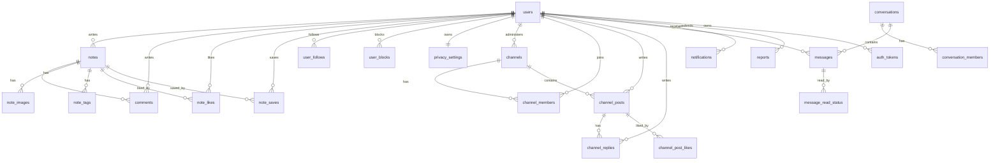

### 7.4 关键索引策略

| 表 | 索引 | 目的 |
| --- | --- | --- |
| `notes` | `idx_note_author_created (author_id, created_at)` | 按作者时间排序 |
| `notes` | `idx_note_visibility_created (visibility, created_at)` | 公开笔记流排序 |
| `comments` | `idx_comment_note_created (note_id, created_at)` | 笔记评论时间序 |
| `channel_posts` | `idx_channel_post_order (channel_id, pinned, created_at)` | 置顶优先+时间序 |
| `notifications` | `idx_notification_user_read_created (user_id, is_read, created_at)` | 未读通知查询 |
| `reports` | `idx_report_status_created (status, created_at)` | 举报处理队列 |
| `auth_tokens` | `idx_auth_token_user (user_id)` / `idx_auth_token_expires (expires_at)` | 登录态查询和过期清理 |

## 8. UI 界面设计

### 8.1 整体布局

左侧固定导航栏 + 顶部标题栏 + 中间主内容区 + 全局弹窗层。

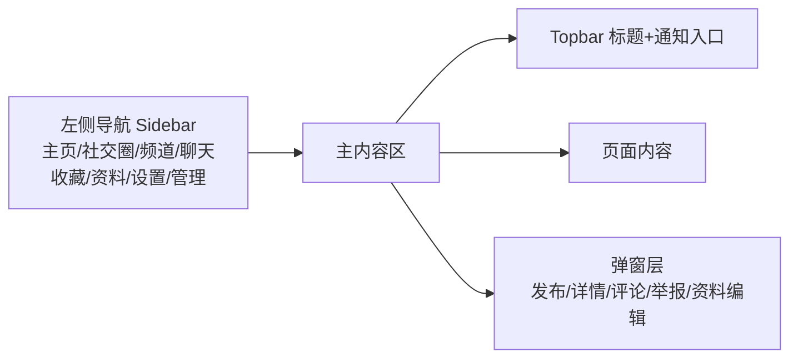

### 8.2 页面清单

| 页面 | 组件 | 核心功能 |
| --- | --- | --- |
| 登录/注册 | `AuthPage` | 登录、注册、找回密码、验证码 |
| 主页 | `HomePage` + `NotesFeed` | 公共笔记流、搜索、标签筛选、发布入口 |
| 社交圈 | `SocialCirclePage` | 关注者笔记流、关注/拉黑/私信入口 |
| 频道 | `ChannelsPage` | 频道列表、详情、发帖、回复、公告、置顶 |
| 聊天 | `ChatsPage` | 会话列表、消息窗口、发送、已读标记 |
| 收藏 | `SavedPage` | 已收藏笔记列表 |
| 个人资料 | `ProfilePage` | 个人信息展示与编辑 |
| 设置 | `SettingsPage` | 隐私设置、黑名单、主题切换 |
| 全站管理 | `AdminPage` | 统计面板、用户/频道管理、内容治理 |

### 8.3 关键交互设计

| 交互 | 实现方式 |
| --- | --- |
| 登录态保持 | `localStorage["whu-token"]`，刷新后调用 `/auth/me` 恢复 |
| 接口错误处理 | `client.js` 统一将非 0 code 转为 `ApiError`，页面按场景展示 |
| 通知提醒 | Topbar 通知入口，支持单条/全部已读 |
| 频道访问控制 | 未加入可预览部分帖子，加入后可发帖、回复、点赞 |
| 管理入口显隐 | `currentUser.role === "ADMIN"` 时侧栏显示"全站管理" |
| 图片上传流程 | 先上传拿 URL，再将 URL 随笔记提交 |

### 8.4 视觉风格

- 卡片、列表、弹窗、轻量按钮组合布局
- 图标库：`@phosphor-icons/react`
- 主题色通过 `themeOptions` 和 CSS class 切换
- 管理界面与普通界面保持统一视觉体系

---

## 附录：安全设计要点

| 层次 | 措施 |
| --- | --- |
| 认证 | Bearer Token，`AuthenticationInterceptor` 拦截校验 |
| 密码 | BCrypt 哈希，不存明文 |
| 验证码 | `code_hash` 存储，区分 scene，限制尝试次数 |
| 注册 | 校验 `@whu.edu.cn` 邮箱域名 |
| 内容可见性 | PUBLIC / FRIENDS / PRIVATE 三级，拉黑关系阻断访问 |
| 管理权限 | Controller 层拦截 + Service 层 `requireAdmin` 双重校验 |
| 文件安全 | 仅允许 jpg/png/gif/webp，限 5MB，UUID 文件名，路径归一化 |
| 封禁用户 | 即使持有有效 token 也被拦截器拒绝 |
